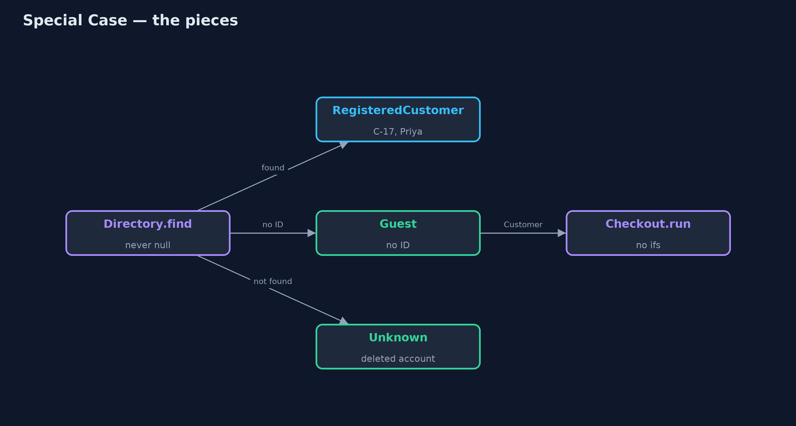
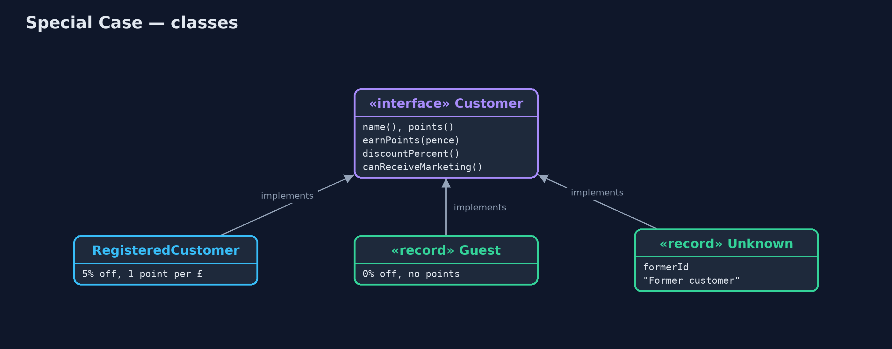
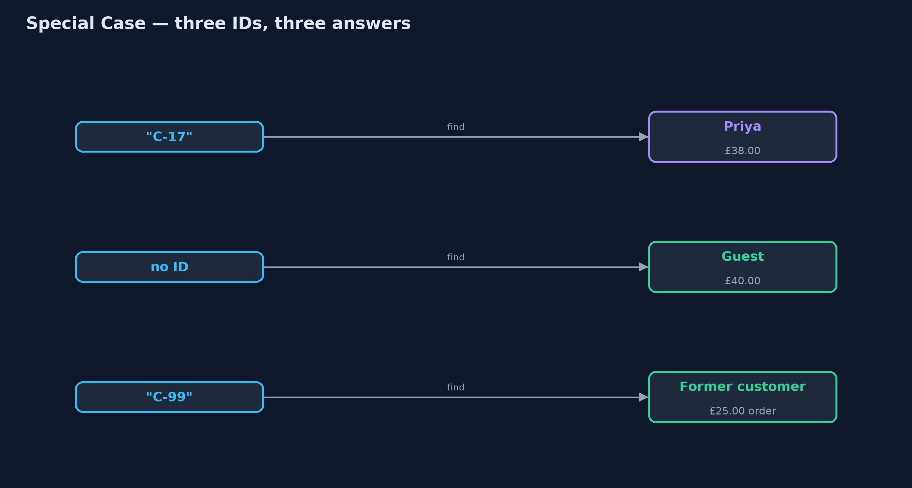
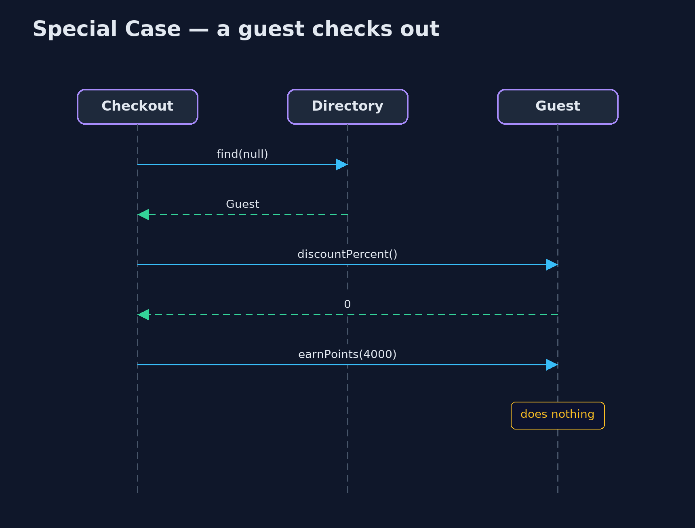

# Special Case Pattern

```
src/main/java/com/jk/explore/specialcase/
├── Checkout.java            Checkout, written twice: with null checks, and against the Customer interface with no checks at all
├── Customer.java            Everything checkout needs from a customer
├── Directory.java           Finds customers
├── RegisteredCustomer.java  An ordinary customer with an account, loyalty points and a member discount
├── SpecialCaseDemo.java     The five acts: null checks, a guest special case, an unknown customer, behaviour instead of type checks, and the bill
└── SpecialCases.java        The pattern: customers for the special situations, each answering every question sensibly instead of being null
```

**Instead of returning null for a guest or a missing account, return an object for that special case, which answers every question in the right way for it.**

Special Case is one of Martin Fowler's enterprise application patterns. When a
lookup has nothing ordinary to return (no customer is logged in, or the
account was deleted), it returns an object for that particular situation
instead of `null`. The object implements the same interface as the ordinary
case, and answers every question in the way that fits: a guest has no
loyalty points, a former customer cannot be emailed.

Callers stop writing `if (customer == null)`, and a forgotten check can no
longer crash the program. Null Object is the simplest special case, one that
does nothing; Special Case allows several, each with its own meaning.

## The idea in everyday terms

Think of the name badges at a conference. Registered delegates get a printed
badge with their name. Walk-in visitors get a "Visitor" badge, and people
whose registration was cancelled but who turn up anyway get a "Guest of the
organisers" badge. Every door and every stall reads a badge the same way; nobody
has to stop and ask "wait, do you have a badge at all?"

## The scenario

The online store looks customers up at checkout. Guests have no account, and
some old orders belong to accounts that have since been deleted. In both cases
the lookup returned `null`, and checkout checked for null in four places. The
loyalty points line forgot, and the first guest to check out crashed the page.

## Run

```bash
./gradlew run
```

The demo tells the story in 5 acts, each printing exact numbers that the tests check:

| Act | What it shows |
| --- | --- |
| 1. Null checks everywhere | Priya pays £38.00; a guest checking out causes a NullPointerException because the points line forgot its check. |
| 2. A guest special case | The lookup returns a Guest; checkout has no ifs; the guest pays £40.00 with 0 points. |
| 3. An unknown customer | An old order by deleted account C-99 shows "Former customer" and the report runs. |
| 4. Behaviour, not type checks | Newsletter: Priya yes, Guest no, Former customer no; no instanceof anywhere. |
| 5. The bill | A mistyped ID, C-71, quietly becomes "Former customer"; every new Customer method needs writing three times. |

## Test

```bash
./gradlew test
```

8 tests in `DemoRunsTest`, `SpecialCaseTest`. Every number the demo prints is asserted, and nothing depends on the clock, so every run gives the same result.

## Technologies and versions

| Technology | Version | Used for |
| --- | --- | --- |
| Java | 21 | the code (toolchain set in `build.gradle`) |
| Gradle | 9.2.1 (wrapper) | build and run, nothing to install |
| JUnit | 5.10.2 | the tests |
| videokit | repository tool | the narrated video and animation: Piper `en_US-amy-medium`, speed 0.8, longer pauses (the approved `amy-slow` voice) |

## Learning Material

| Document | What it is for |
| --- | --- |
| [Problem statement](docs/problem-statement.md) | the situation and what the project must show |
| [Prerequisites](docs/prerequisites.md) | what you need to know first |
| [Special Case, explained](docs/special-case-pattern-explained.md) | the acts in prose |
| [Session guide](docs/session.md) | a one-hour lesson with exercises |
| [Animated walkthrough](docs/animation.html) | the acts step by step, narrated |
| [Spec](docs/spec.md) | what this project must be true of |

### The pattern in one picture

The lookup always returns a Customer; checkout treats them all the same.



### Where each piece sits

Three implementations of one interface.



### How the data moves

What the lookup returns for each input.



### Who calls whom, in order

No null, no check, no crash.



### Video

`video/special-case-pattern-explained.mp4` (with `.m4a` audio and `.srt` subtitles) is built by `video/build_video.sh`. Rendered media is not committed.

## What it costs

- **Mistakes can hide.** A mistyped ID quietly becomes "Former customer" and checkout carries on, instead of failing loudly.
- **Every case, every method.** Each new method on `Customer` must be written for `Guest` and `Unknown` too.
- **More classes.** One per special situation.

## When this is too much

When a missing value really is an error, say so: throw, or return an `Optional`
and make the caller decide. Special cases are for situations that are normal
and have a sensible meaning, like a guest checkout, not for bugs.

## Where you have already met this

- `Collections.emptyList()`, a special case for "no items".
- Anonymous users in web frameworks, such as Spring Security's `AnonymousAuthenticationToken`.
- "Unknown" or "Deleted user" shown in place of a removed account on forums and shops.

## Where this sits

This project is in [enterprise-design-patterns](..). Its simplest form, a
single do-nothing object, is the
[Null Object](../../foundational-design-patterns/null-object-pattern) pattern.
