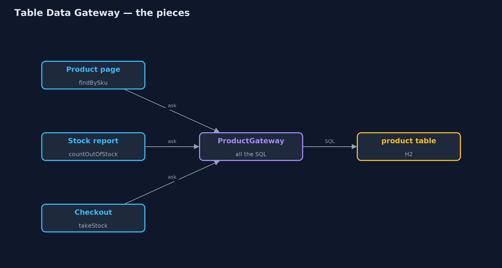

# Table Data Gateway Pattern

```
src/main/java/com/jk/explore/tabledatagateway/
├── Database.java               A fresh in-memory H2 database with the shop's product table and four products
├── Pages.java                  The same three callers, now asking the gateway
├── ProductGateway.java         The pattern: the one class that holds every piece of SQL for the product table
├── TableDataGatewayDemo.java   The five acts: SQL in every caller, a table data gateway, a renamed column, where the SQL lives, and the bill
├── scattered/CheckoutSql.java  Without the pattern: checkout updates stock with its own SQL
├── scattered/ProductPage.java  Without the pattern: the product page writes its own SQL
└── scattered/StockReport.java  Without the pattern: the stock report writes its own SQL too
```

**Give each database table one class that holds all of its SQL, so the rest of the program asks plain questions and never writes SQL itself.**

Table Data Gateway is one of Martin Fowler's enterprise application patterns.
For each database table there is one class, the gateway, that holds every
piece of SQL for that table: finding rows, inserting, updating, deleting. The
rest of the program calls plain methods such as `findBySku` or `takeStock`,
and gets plain records back. It never sees SQL, connections or result sets.

When the table changes, only its gateway changes. It is the simplest of the
patterns for separating database code from the rest of an application.

## The idea in everyday terms

Think of a bank. Customers do not walk into the vault and count the notes
themselves. They go to the counter and ask: pay in this, give me that, what is
my balance. When the bank reorganises its vault, only the counter staff need
to learn the new layout; the customers ask exactly the same questions.

## The scenario

The online store keeps products in a database table with a code, a name, a
price and a stock count. The product page, the stock report and checkout
each wrote their own SQL against it. When the database team renamed the
`stock` column to `quantity`, all three broke at once.

## Run

```bash
./gradlew run
```

The demo tells the story in 5 acts, each printing exact numbers that the tests check:

| Act | What it shows |
| --- | --- |
| 1. SQL in every caller | The page, report and checkout each write their own SQL; after stock is renamed to quantity, all three fail with Column "STOCK" not found. |
| 2. A table data gateway | ProductGateway holds the table's SQL; the same three callers ask it plain questions and get Row records back. |
| 3. A rename, fixed once | After the same rename, the gateway is told the new column name in one place, and all three callers work. |
| 4. Where the SQL lives | Old way: 3 classes mention the product table; new way: 0 callers do, and 1 gateway class does. |
| 5. The bill | A Row is data only, so rules like "low on stock" live in callers; the gateway grows a method per question. |

## Test

```bash
./gradlew test
```

8 tests in `DemoRunsTest`, `ProductGatewayTest`. Every number the demo prints is asserted, and nothing depends on the clock, so every run gives the same result.

## Technologies and versions

| Technology | Version | Used for |
| --- | --- | --- |
| Java | 21 | the code (toolchain set in `build.gradle`) |
| Gradle | 9.2.1 (wrapper) | build and run, nothing to install |
| JUnit | 5.10.2 | the tests |
| H2 Database | 2.5.252 | an in-memory SQL database, so the demo runs real SQL with nothing installed |
| videokit | repository tool | the narrated video and animation: Piper `en_US-amy-medium`, speed 0.8, longer pauses (the approved `amy-slow` voice) |

## Learning Material

| Document | What it is for |
| --- | --- |
| [Problem statement](docs/problem-statement.md) | the situation and what the project must show |
| [Prerequisites](docs/prerequisites.md) | what you need to know first |
| [Table Data Gateway, explained](docs/table-data-gateway-pattern-explained.md) | the acts in prose |
| [Session guide](docs/session.md) | a one-hour lesson with exercises |
| [Animated walkthrough](docs/animation.html) | the acts step by step, narrated |
| [Spec](docs/spec.md) | what this project must be true of |

### The pattern in one picture

Callers ask the gateway; only the gateway talks to the table.



### Where each piece sits

One gateway, one record type.


### How the data moves

A plain question in, SQL in the middle, a plain record out.


### Who calls whom, in order

Checkout never sees SQL.


### Video

`video/table-data-gateway-pattern-explained.mp4` (with `.m4a` audio and `.srt` subtitles) is built by `video/build_video.sh`. Rendered media is not committed.

## What it costs

- **Rows, not objects with rules.** A gateway returns data; business rules such as "low on stock" end up in each caller.
- **It grows.** Every new question anyone asks the table becomes another method on the gateway.
- **One class per table.** Queries that join several tables do not have an obvious home.

## When this is too much

When a table is used in exactly one place, a query in that place is fine. And
when the rows carry real behaviour, Active Record or Data Mapper, which return
objects rather than rows, fit better.

## Where you have already met this

- DAO classes (Data Access Objects), such as `ProductDao`.
- Spring's `JdbcTemplate` wrapped in one class per table.
- MyBatis mapper interfaces, one per table.

## Where this sits

This project is in [enterprise-design-patterns](..), next to
[Repository](../repository-pattern), which works with whole domain objects
instead of rows, and [Query Object](../query-object-pattern), which builds the
questions a gateway or repository can answer.
