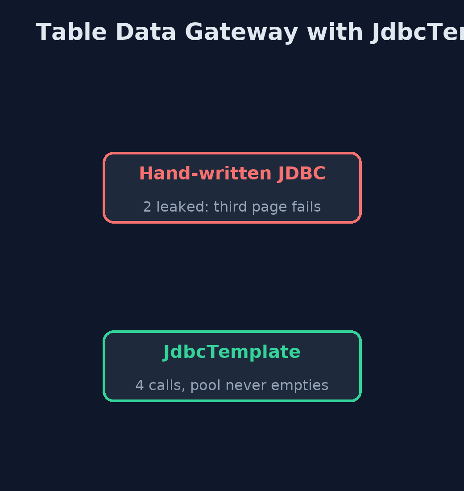

# Table Data Gateway with JdbcTemplate Pattern

```
src/main/java/com/jk/explore/tdgjdbc/
├── JdbcTemplateGatewayDemo.java  The five acts, with Spring's JdbcTemplate and an in-memory H2 database
├── ProductGateway.java           The pattern: every piece of SQL for the product table, in one class
├── Row.java                      One row of the product table, as plain data
├── ScatteredJdbc.java            Before: a page that writes its own JDBC, and forgets to close the connection it borrowed
└── ShopApp.java                  The Spring Boot application: an in-memory H2 database, a small connection pool and JdbcTemplate
```

**Keep all the product table's SQL in one gateway class built on Spring's JdbcTemplate, which borrows and returns connections, maps rows to records, and turns database errors into meaningful exceptions.**

This is the framework version of the Table Data Gateway pattern. The plain
Java version, a separate project in this category, writes JDBC by hand inside
its gateway. Here Spring's JdbcTemplate does the plumbing, with an in-memory H2
database and a real HikariCP connection pool, so nothing has to be installed.

The gateway, a Spring `@Repository`, still owns every piece of SQL for the
product table. JdbcTemplate borrows a connection for each call and always
gives it back, `DataClassRowMapper` fills the `Row` record by column name, and
Spring translates database errors into its own exception types, such as
`BadSqlGrammarException` and `DuplicateKeyException`, whatever the database.

## The idea in everyday terms

Think of a library's front desk. Nobody walks into the stacks: you ask the
desk, and the desk fetches and returns books the same careful way every time.
If the library moves a shelf, only the desk staff need to know.

## The scenario

The online store's product page, stock report and checkout each wrote their
own JDBC against the product table. One page borrowed database connections
and never gave them back, and every page broke at once when a column was
renamed.

## Run

Nothing to install beyond a Java 21 JDK: Spring Boot, the connection pool and
an in-memory H2 database all run inside the program.

```bash
./gradlew run
```

The demo tells the story in 5 acts, each printing exact numbers that the tests check:

| Act | What it shows |
| --- | --- |
| 1. Hand-written JDBC that leaks | A page that never closes its connection runs twice on a pool of 2; the third call fails after 0.25 s because the pool is empty. |
| 2. A gateway on JdbcTemplate | The gateway serves the product page 4 times on the same pool of 2, the stock report and a cheaper-than-£10 list; no leaks. |
| 3. Errors that mean something | A renamed column gives BadSqlGrammarException; a second MUG-1 gives DuplicateKeyException, whatever the database. |
| 4. Stock in one statement | 4 customers try for 2 desk lamps: 2 are taken and stock ends at 0, with UPDATE ... WHERE quantity > 0. |
| 5. The bill | A Row is data only, the gateway grows a method per question, and its SQL is still text checked only when it runs. |

## Test

```bash
./gradlew test
```

1 tests in `DemoRunsTest`. Every result the demo prints is asserted, with Spring's JdbcTemplate, a HikariCP pool and an in-memory H2 database.

## What the simulation got right, and what it left out

The plain Java version got the idea right: all of one table's SQL in one
class, callers receiving plain rows, and a schema change fixed in one place.
What it left out is the plumbing a framework takes over, and why it matters.
Hand-written JDBC that forgot to close drained a real pool of two
connections, and the third page failed after 0.25 seconds; JdbcTemplate
served four requests on the same pool without a leak. Spring also translates
errors: a renamed column became BadSqlGrammarException, and a repeated key
DuplicateKeyException, the same on any database.

## Technologies and versions

| Technology | Version | Used for |
| --- | --- | --- |
| Java | 21 | the code (toolchain set in `build.gradle`) |
| Gradle | 9.2.1 (wrapper) | build and run, nothing to install |
| JUnit | 5.10.2 | the tests |
| Spring Boot | 4.1.1 | starts the pool and the database |
| Spring JDBC | with Spring Boot 4.1.1 | NamedParameterJdbcTemplate, DataClassRowMapper, exception translation |
| HikariCP | with Spring Boot 4.1.1 | the connection pool, sized to 2 |
| H2 | with Spring Boot 4.1.1 | the in-memory database |
| videokit | repository tool | the narrated video and animation: Piper `en_US-amy-medium`, speed 0.8, longer pauses (the approved `amy-slow` voice) |

## Learning Material

| Document | What it is for |
| --- | --- |
| [Dependencies](docs/dependencies.md) | what the framework and infrastructure are, and why they are here |
| [Problem statement](docs/problem-statement.md) | the situation and what the project must show |
| [Prerequisites](docs/prerequisites.md) | what you need to know first |
| [Table Data Gateway with JdbcTemplate, explained](docs/table-data-gateway-with-jdbc-template-pattern-explained.md) | the acts in prose |
| [Session guide](docs/session.md) | a one-hour lesson with exercises |
| [Animated walkthrough](docs/animation.html) | the acts step by step, narrated |
| [Spec](docs/spec.md) | what this project must be true of |

### The pattern in one picture

One class of SQL; Spring does the plumbing.


### Where each piece sits

SQL in one place.


### How the data moves

Leaked, or always returned.



### Who calls whom, in order

Borrow, query, map, return.


### Video

`video/table-data-gateway-with-jdbc-template-pattern-explained.mp4` (with `.m4a` audio and `.srt` subtitles) is built by `video/build_video.sh`. Rendered media is not committed.

## What it costs

- **Rows, not objects with rules.** A Row is data only; "low on stock" must be decided by each caller.
- **A method per question.** The gateway grows with every question anyone asks the table.
- **SQL is still text.** Mistakes appear only when the query runs, as a BadSqlGrammarException.

## When this is too much

For one or two queries, calling JdbcTemplate directly is fine. A gateway pays
off when several parts of the code use the same table and its SQL should
live in one place.

## Where you have already met this

- Spring `@Repository` classes built on `JdbcTemplate`.
- Spring Data JDBC and jOOQ, which generate or type the SQL.
- DAO classes, the older name for the same idea.

## Where this sits

This project is in [enterprise-design-patterns](..). It is the framework
version of the plain Java Table Data Gateway project in the same category,
which is left unchanged.
