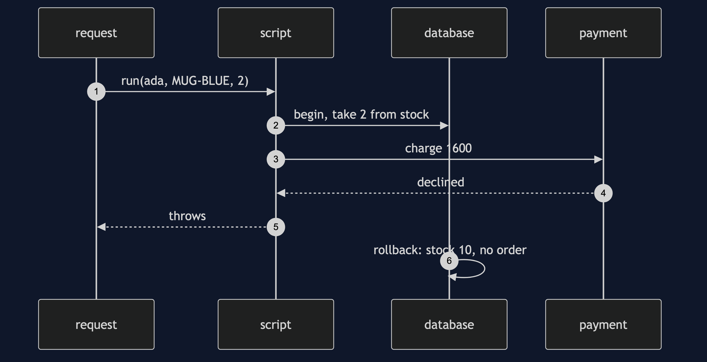

# Transaction Script Pattern

```
src/main/java/com/jk/explore/transactionscript/
├── TransactionScriptDemo.java       the six acts
├── Db.java                          stock and orders, with a transaction that rolls back
│
└── script/
    ├── PlaceOrderScript.java         the whole action, one method
    ├── AmendOrderScript.java         a second script that copied the pricing
    ├── Pricing.java                  the shared helper
    ├── PlaceOrderScriptGrown.java    the first script a year later
    ├── MonthEndScript.java           a script at its best
    └── Payment.java
```

**A transaction script is one procedure per request, run as one transaction. Simple, direct, and it grows in the middle.**

This project is in [enterprise-design-patterns](..). It is the simplest way to organise business logic, and the baseline the other logic patterns, [Service Layer](../service-layer-pattern) and the domain model, are measured against.

## Run

```bash
./gradlew run
```

Six acts. Every number quoted below comes from this program's own output.

```
ONE. One request, one procedure.
  ORD-1 for £16.00. stock of MUG-BLUE: 8.
  the whole business action is one method, read from the top to the bottom.
TWO. One transaction.
  card declined after the stock was taken.
  stock of MUG-BLUE: 10. orders saved: 0. the script's changes were undone together.
THREE. A second script copies the rule.
  7 mugs placed: £50.40. the same 7 mugs amended: £56.00.
  the bulk discount changed from 10 items to 5. one script was told, the other was not.
FOUR. Share a procedure.
  7 mugs priced by the shared helper: £50.40 in both scripts.
  it is still procedural. there is no Order object, only a function both scripts call.
FIVE. The bill: growth.
  decisions in the first script: 3, so 8 paths to test.
  decisions after three more rules: 7, so 128 paths to test.
  every new rule went in the middle of one method.
SIX. Where a script is right.
  month end: 2 orders, £316.00 taken.
  a job with one purpose and a few rules is clearer as a script than as a set of objects.
```

## Test

```bash
./gradlew test
```

2 test classes, 9 test methods, offline, with nothing installed and no framework.

## Technologies and versions

| What | Version | Why it is here |
| --- | --- | --- |
| Java | 21 | The repository standard, via the Gradle toolchain block |
| Gradle | 9.2.1 | The wrapper in this directory; no separate install needed |
| JUnit 5 | 5.10.2 | Test runner |

No framework. A hand-built project stays plain Java so the mechanism is the whole lesson.

## Learning Material

| Document | What it covers |
| --- | --- |
| [`docs/problem-statement.md`](docs/problem-statement.md) | One action, one method |
| [`docs/transaction-script-pattern-explained.md`](docs/transaction-script-pattern-explained.md) | The pattern, and six acts |
| [`docs/class-diagram.md`](docs/class-diagram.md) | The types |
| [`docs/architecture-diagram.md`](docs/architecture-diagram.md) | A script, a transaction and a helper |
| [`docs/data-flow-diagram.md`](docs/data-flow-diagram.md) | The steps of one request |
| [`docs/sequence-diagram.md`](docs/sequence-diagram.md) | Written for a listener with the screen off |
| [`docs/uml-diagram.md`](docs/uml-diagram.md) | Four sequences |
| [`docs/animation.html`](docs/animation.html) | The six acts in a browser |
| [`docs/prerequisites.md`](docs/prerequisites.md) | What you need to know |
| [`docs/session.md`](docs/session.md) | A one-hour taught session |
| [`docs/spec.md`](docs/spec.md) | The generated specification |
| [`docs/youtube.md`](docs/youtube.md) | Title, description and chapters |

### The pattern in one picture


### Where each piece sits


### How one request moves


### Who calls whom, in order



### All four sequences


### Video

Built from [`video/scenes.py`](video/scenes.py) by
[`video/build_video.sh`](video/build_video.sh). The rendered file is not
committed; see the repository README for why.

## Where you have already met this

Most small Spring and Java EE services, and nearly every report or batch job.

## When this is too much

A script is the opposite of too much. Its risk is too little structure as the rules grow, so watch the decisions in the middle of the method.

## Where this sits

This project is in [`enterprise-design-patterns`](..), and is meant to be read with its neighbours there.
