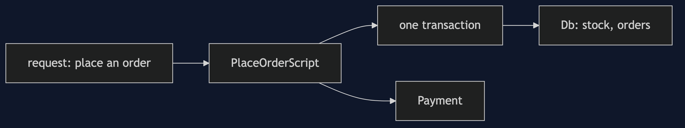
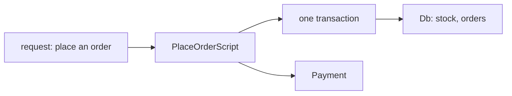

# Transaction Script Pattern — Architecture Diagram

A request runs one script, in one transaction.

Mermaid source

```mermaid
flowchart LR
    R["request: place an order"] --> S["PlaceOrderScript"]
    S --> T["one transaction"]
    T --> D["Db: stock, orders"]
    S --> P["Payment"]
```

