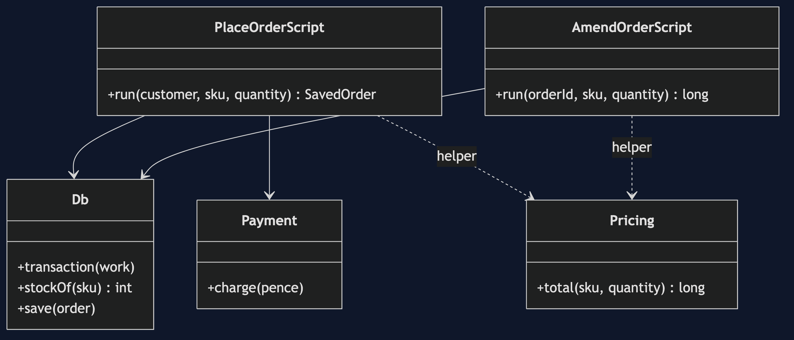
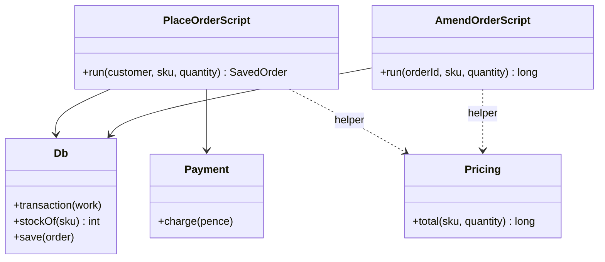

# Transaction Script Pattern — Class Diagram

Scripts are classes with one method. They share a helper, not an object model.

Mermaid source

```mermaid
classDiagram
    class PlaceOrderScript {
        +run(customer, sku, quantity) SavedOrder
    }
    class AmendOrderScript {
        +run(orderId, sku, quantity) long
    }
    class Pricing {
        +total(sku, quantity) long
    }
    class Db {
        +transaction(work)
        +stockOf(sku) int
        +save(order)
    }
    class Payment {
        +charge(pence)
    }
    PlaceOrderScript --> Db
    PlaceOrderScript --> Payment
    AmendOrderScript --> Db
    PlaceOrderScript ..> Pricing : helper
    AmendOrderScript ..> Pricing : helper
```

