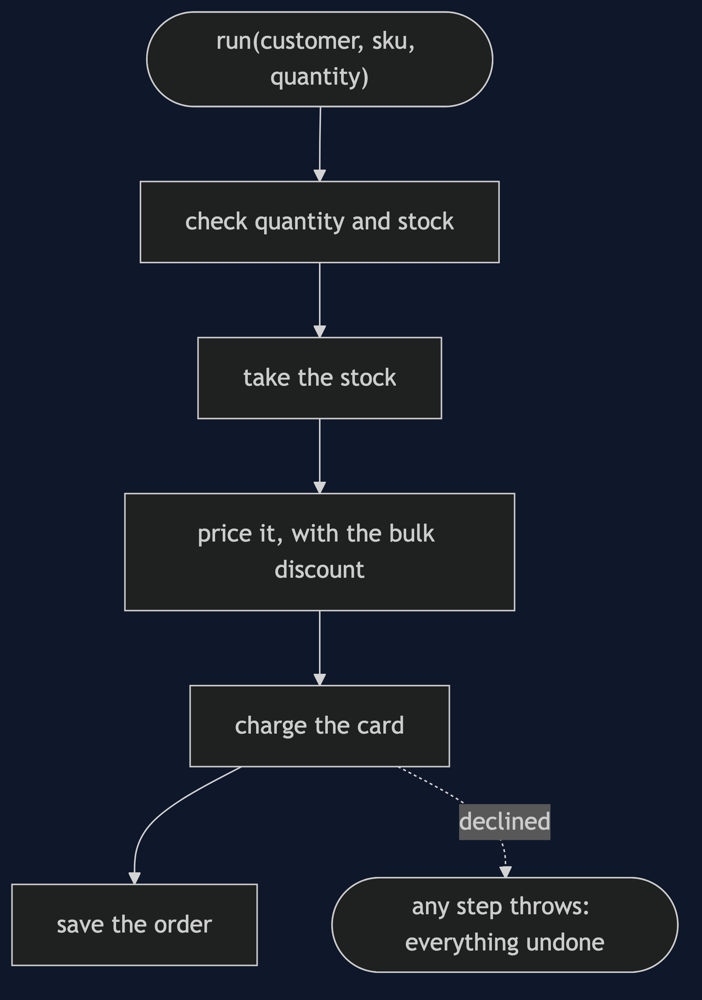
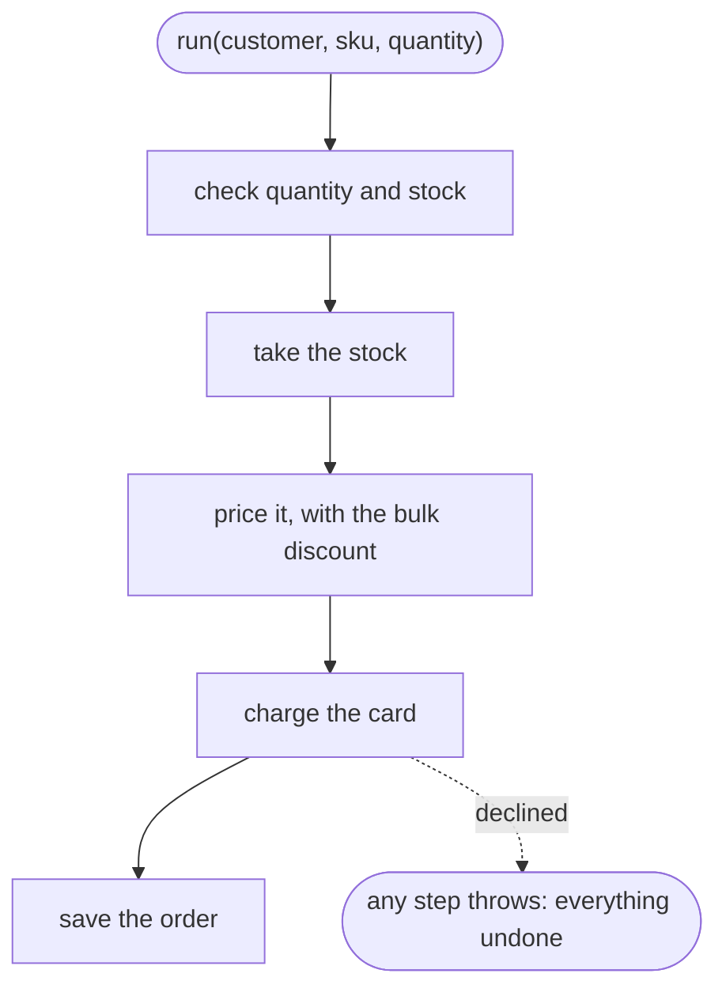

# Transaction Script Pattern — Data Flow Diagram

The steps of one script, top to bottom.

Mermaid source

```mermaid
flowchart TD
    A(["run(customer, sku, quantity)"])
    B["check quantity and stock"]
    C["take the stock"]
    D["price it, with the bulk discount"]
    E["charge the card"]
    F["save the order"]
    X(["any step throws: everything undone"])
    A --> B --> C --> D --> E --> F
    E -. declined .-> X
```

