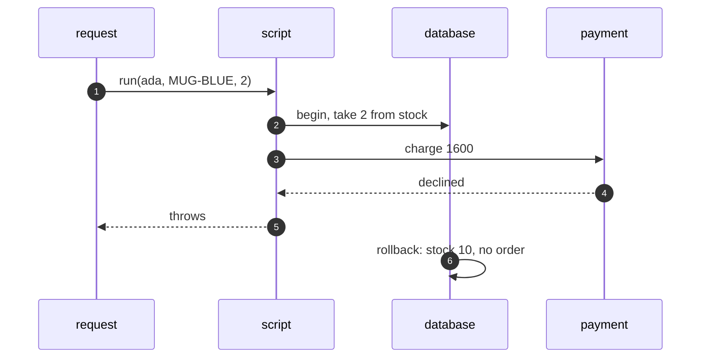

# Transaction Script Pattern — Sequence Diagram

Written for a listener with the screen off.

Say it in words. The request calls the place order script. The script opens a transaction and checks the quantity and the stock. It takes two from the stock and prices the order at sixteen pounds. It charges the card, and the card is declined, so the script throws. The database undoes the stock change. The stock is ten again, and nothing was saved.

Mermaid source

The load-bearing sentence: **one script is one transaction, so a failure leaves nothing half done.**
