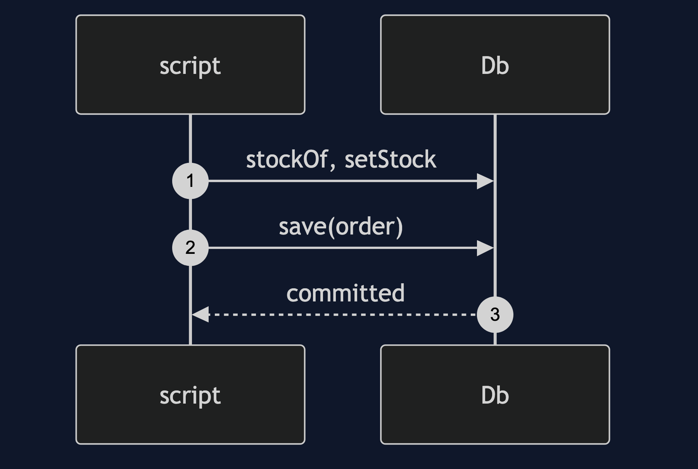
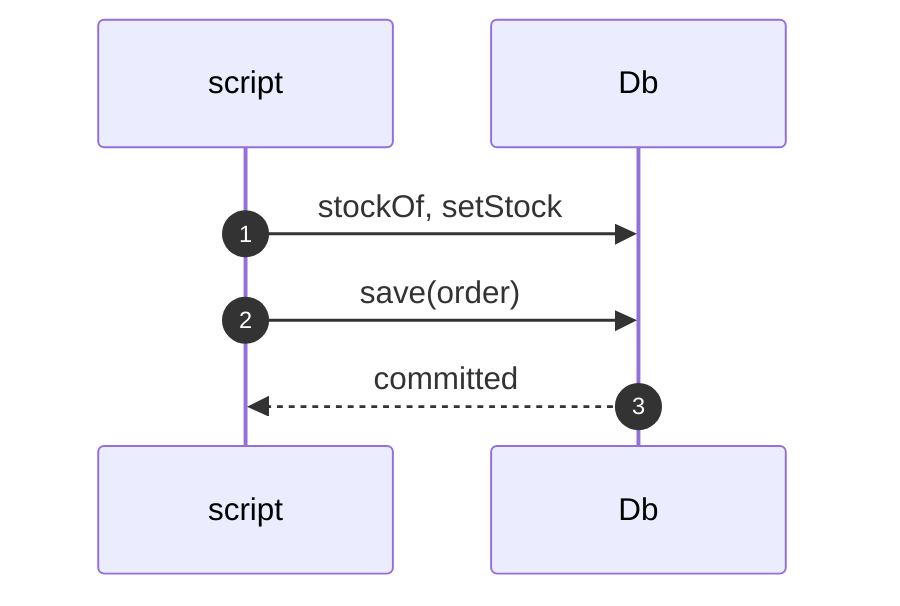
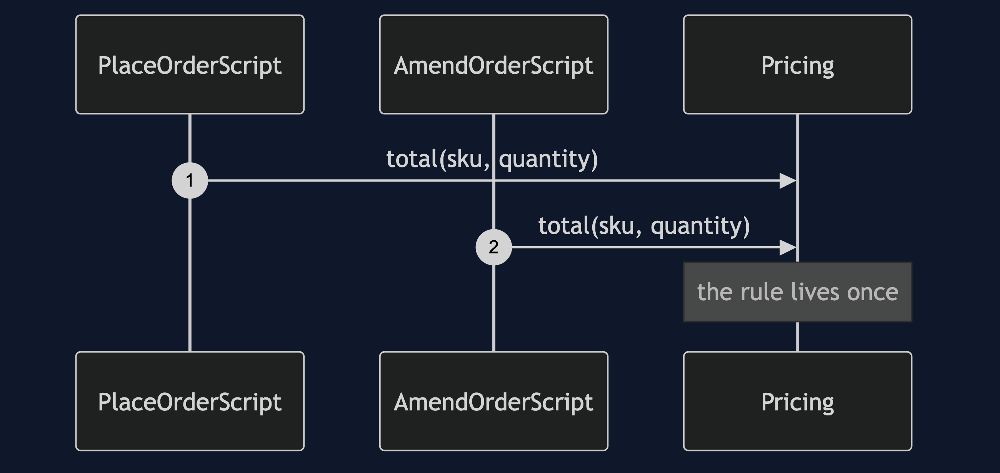
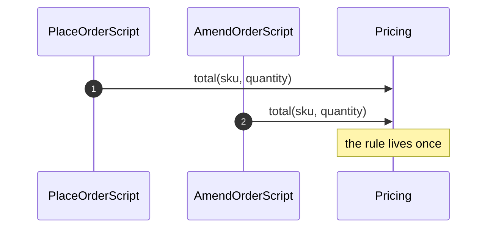

# Transaction Script Pattern — UML Sequence Diagrams

Four sequences.

## 1. A Successful Order

Mermaid source

```mermaid
sequenceDiagram
    autonumber
    participant S as script
    participant D as Db
    S->>D: stockOf, setStock
    S->>D: save(order)
    D-->>S: committed
```

## 2. Two Scripts, One Rule

Mermaid source

```mermaid
sequenceDiagram
    autonumber
    participant P as PlaceOrderScript
    participant A as AmendOrderScript
    participant H as Pricing
    P->>H: total(sku, quantity)
    A->>H: total(sku, quantity)
    Note over H: the rule lives once
```

