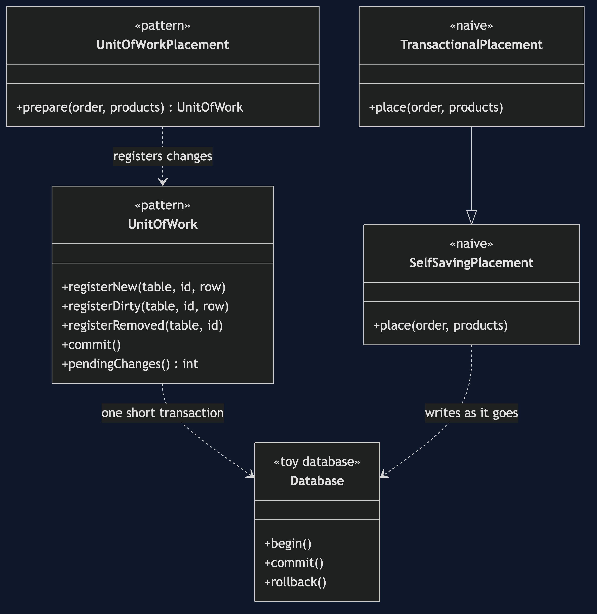
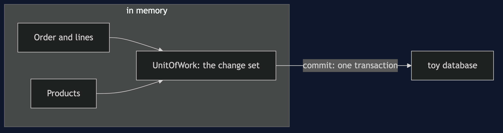
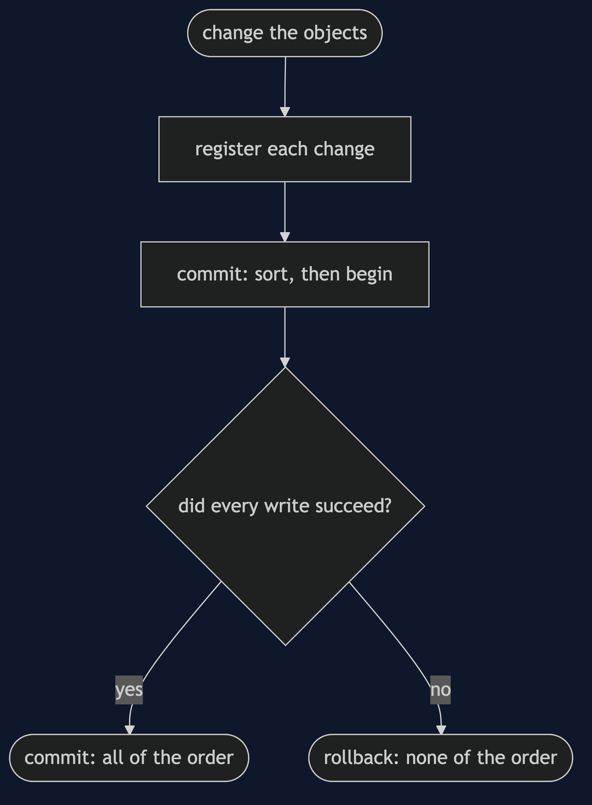
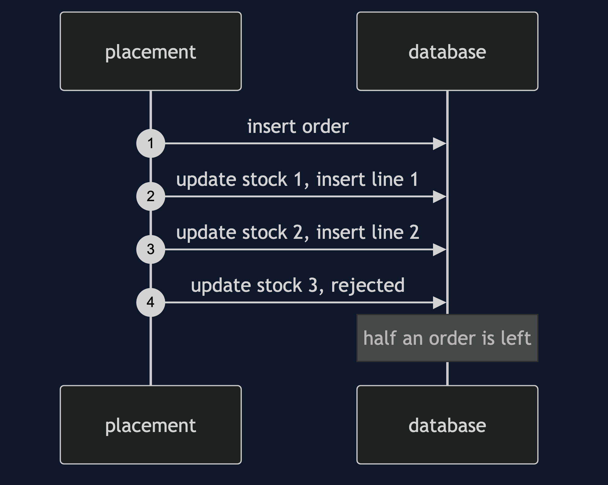
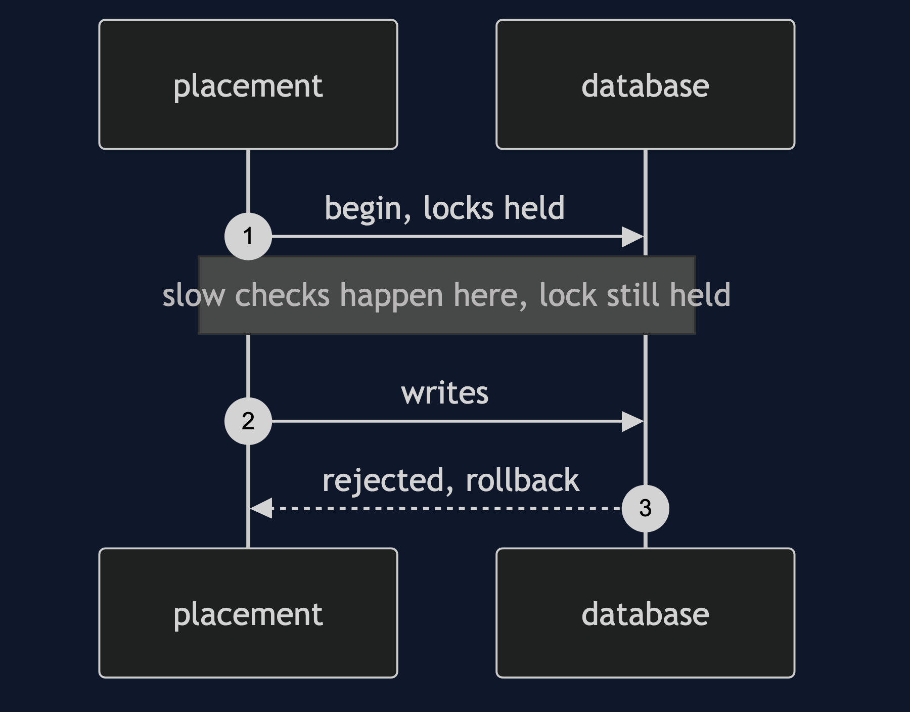
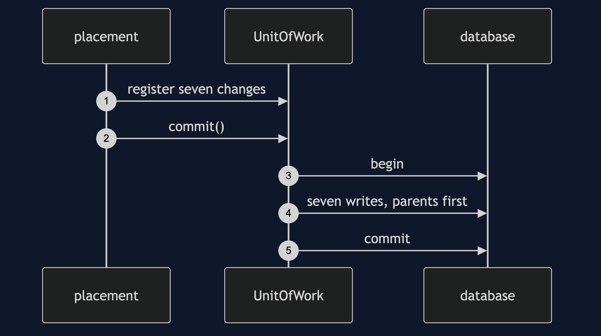
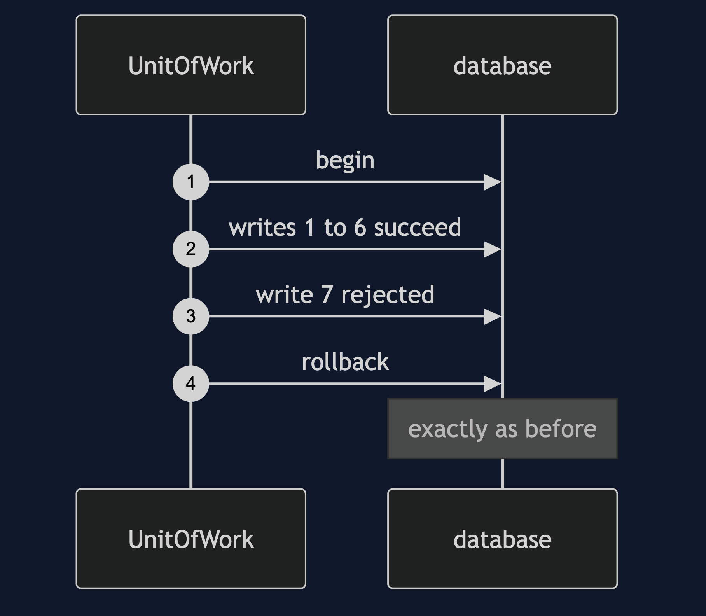

# Unit of Work Pattern

```
src/main/java/com/jk/explore/unitofwork/
├── OrderDemo.java                   composition root — the six acts
│
├── toydb/                           ← the toy database, with begin/rollback and a foreign key
├── domain/
│   ├── Product.java  Order.java  OrderLine.java
│   └── Shop.java                     the seeded store and the row conversions
├── naive/
│   ├── SelfSavingPlacement.java      each object saves itself as it changes
│   └── TransactionalPlacement.java   wrapped in a transaction: open the whole time
│
└── pattern/                         ← the real thing
    ├── UnitOfWork.java               register new, dirty, removed; commit once
    └── UnitOfWorkPlacement.java      placing an order through it
```

**Register what changed, and write it all at commit, in one go, in an order the database accepts, or not at all.**

This is the third project in [enterprise-design-patterns](..). The scenario runs through the whole category: an order with three lines, where the write that decrements the third product's stock is rejected.

## Run

```bash
./gradlew run
```

Six acts. Every operation against the toy database is counted, and every count quoted below comes from that counter.

```
UNIT OF WORK — save half an order

ONE. Each object saves itself — the wreckage.
  the third stock update failed: the database rejected: UPDATE products id=3
  orders in the database:      1
  order lines in the database: 2 of 3
  stock now: keyboard 8, mouse 9, monitor 10 (was 10, 10, 10)
  nothing knows it is broken, and nothing can undo it.

TWO. Wrap it in a transaction — it mostly works.
  the third stock update failed, and the transaction rolled back.
  orders: 0, lines: 0, stock: keyboard 10, mouse 10, monitor 10
  the cost: the transaction was open for 22 ticks, including every slow check.

THREE. The pattern — nothing touches the database until commit.
  after changing every object: 0 database operations, 7 changes registered.
  commit wrote them, parents first:
    INSERT orders id=100
    INSERT order_lines id=1001
    INSERT order_lines id=1002
    INSERT order_lines id=1003
    UPDATE products id=1
    UPDATE products id=2
    UPDATE products id=3
  the database was locked for 7 ticks, not 22.

FOUR. The same failure, through a unit of work.
  commit failed: the database rejected: UPDATE products id=3
  orders: 0, lines: 0, stock: keyboard 10, mouse 10, monitor 10
  all of the order, or none of it.

FIVE. The bill — order of writes matters.
  written in the order registered, the lines came before their order:
  foreign key: order_lines.order_id=100 has no row in orders
  the unit of work sorts them: the order first. orders: 1.

SIX. Memory disagrees with the database until commit.
  in memory, the keyboard has 8 in stock.
  in the database, it still has 10.
  the change set lives in memory: 7 changes for one order.
  where you have met this: @Transactional is a unit of work, and a flush is its commit.
```

## Test

```bash
./gradlew test
```

4 test classes, 15 test methods, offline, with no database installed.

## Technologies and versions

| What | Version | Why it is here |
| --- | --- | --- |
| Java | 21 | The repository standard, via the Gradle toolchain block |
| Gradle | 9.2.1 | The wrapper in this directory; no separate install needed |
| JUnit 5 | 5.10.2 | Test runner |

No framework. A hand-built project stays plain Java so the mechanism is the whole lesson.

## Learning Material

| Document | What it covers |
| --- | --- |
| [`docs/problem-statement.md`](docs/problem-statement.md) | The three-line order, and the failing write |
| [`docs/unit-of-work-pattern-explained.md`](docs/unit-of-work-pattern-explained.md) | The pattern, its costs, and where you have met it |
| [`docs/class-diagram.md`](docs/class-diagram.md) | The types |
| [`docs/architecture-diagram.md`](docs/architecture-diagram.md) | Memory, the change set, the database |
| [`docs/data-flow-diagram.md`](docs/data-flow-diagram.md) | One order, to commit or rollback |
| [`docs/sequence-diagram.md`](docs/sequence-diagram.md) | Written for a listener with the screen off |
| [`docs/uml-diagram.md`](docs/uml-diagram.md) | Four sequences |
| [`docs/animation.html`](docs/animation.html) | The six acts in a browser |
| [`docs/prerequisites.md`](docs/prerequisites.md) | What you need to know |
| [`docs/session.md`](docs/session.md) | A one-hour taught session |
| [`docs/spec.md`](docs/spec.md) | The generated specification |
| [`docs/youtube.md`](docs/youtube.md) | Title, description and chapters |

### The pattern in one picture



### Where each piece sits



### How one request moves



### Who calls whom, in order


### All four sequences









### Video

Built from [`video/scenes.py`](video/scenes.py) by
[`video/build_video.sh`](video/build_video.sh). The rendered file is not
committed; see the repository README for why.

## Where you have already met this

`@Transactional` is a unit of work, and a flush is its commit. The persistence context tracks what changed and writes it when the transaction ends.

## When this is too much

For a single write, a unit of work is ceremony. It earns its place when one business action must write several rows together.

## Where this sits

This is the third project in [`enterprise-design-patterns`](..). It uses [Identity Map](../identity-map-pattern)'s idea that objects are tracked, and Spring's version of it is a later project.
