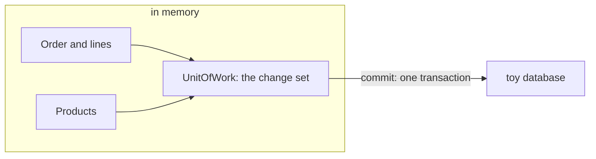

# Unit of Work Pattern — Architecture Diagram

Changes gather in memory and reach the database once.

Mermaid source

```mermaid
flowchart LR
    subgraph Memory["in memory"]
        O["Order and lines"]
        P["Products"]
        U["UnitOfWork: the change set"]
    end
    O --> U
    P --> U
    U -->|commit: one transaction| DB["toy database"]
```

