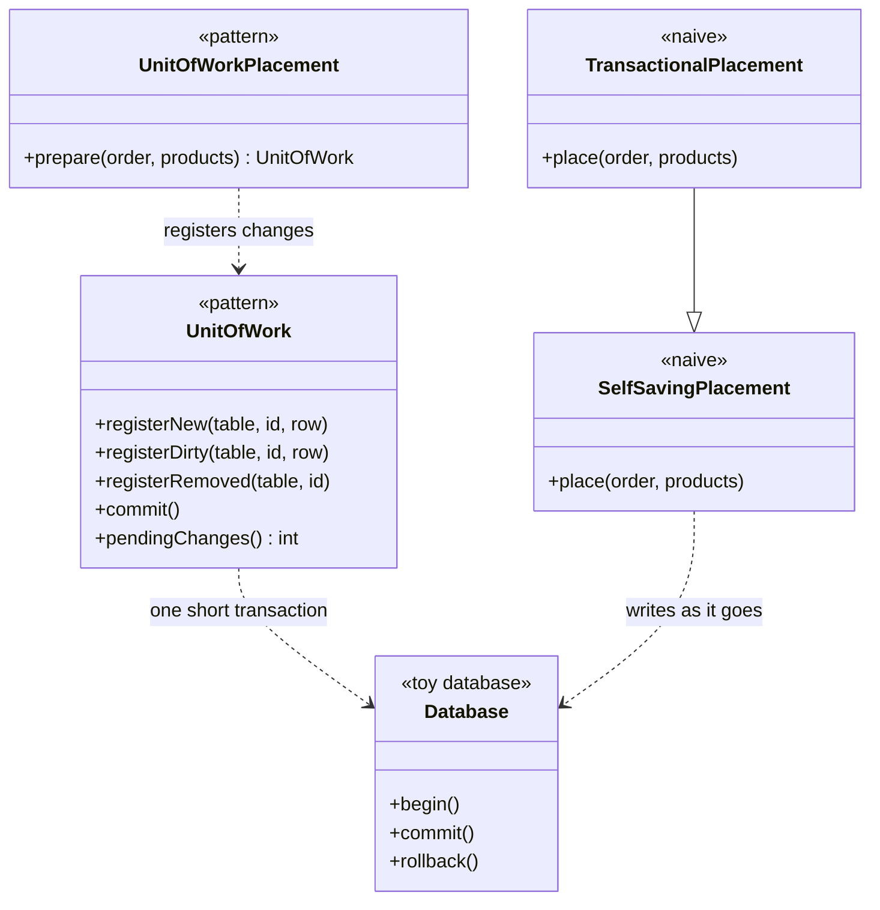

# Unit of Work Pattern — Class Diagram

`UnitOfWork` knows tables and ranks. It does not know orders.

Mermaid source

```mermaid
classDiagram
    class SelfSavingPlacement {
        <<naive>>
        +place(order, products)
    }
    class TransactionalPlacement {
        <<naive>>
        +place(order, products)
    }
    class UnitOfWork {
        <<pattern>>
        +registerNew(table, id, row)
        +registerDirty(table, id, row)
        +registerRemoved(table, id)
        +commit()
        +pendingChanges() int
    }
    class UnitOfWorkPlacement {
        <<pattern>>
        +prepare(order, products) UnitOfWork
    }
    class Database {
        <<toy database>>
        +begin()
        +commit()
        +rollback()
    }
    TransactionalPlacement --|> SelfSavingPlacement
    UnitOfWorkPlacement ..> UnitOfWork : registers changes
    UnitOfWork ..> Database : one short transaction
    SelfSavingPlacement ..> Database : writes as it goes
```

