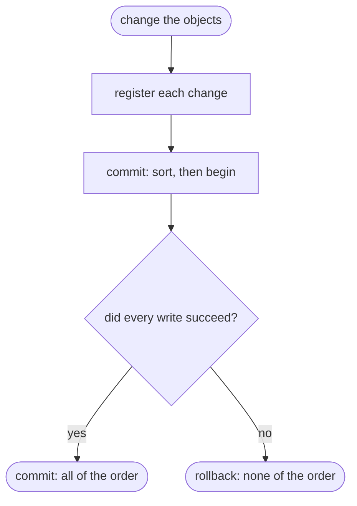

# Unit of Work Pattern — Data Flow Diagram

One order, from registration to commit or rollback.

Mermaid source

```mermaid
flowchart TD
    Change(["change the objects"])
    Reg["register each change"]
    Commit["commit: sort, then begin"]
    Ok{"did every write succeed?"}
    Done(["commit: all of the order"])
    Undo(["rollback: none of the order"])
    Change --> Reg --> Commit --> Ok
    Ok -- yes --> Done
    Ok -- no --> Undo
```

