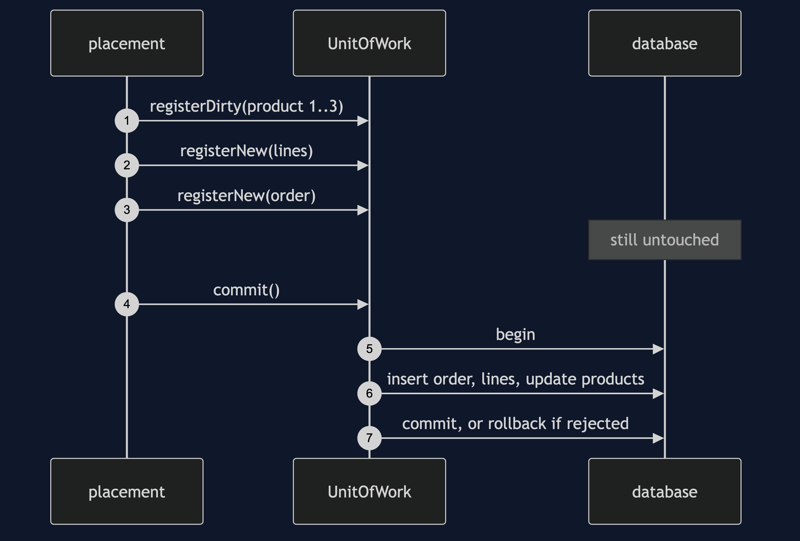
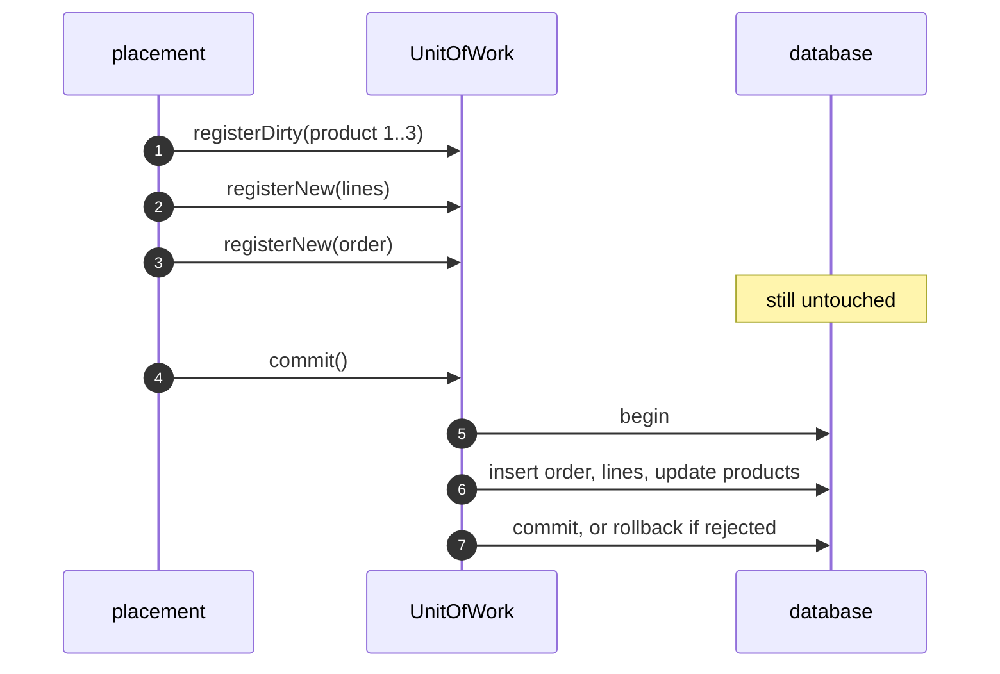

# Unit of Work Pattern — Sequence Diagram

Written for a listener with the screen off.

Say it in words. The placement changes each product and registers each change with the unit of work. It registers the lines, then the order. Nothing has touched the database. Then commit is called. The unit of work sorts its changes so the order comes first, opens a transaction, and writes the order, the three lines and the three stock updates. If any write is rejected, it rolls back and the database is exactly as it was.

Mermaid source

The load-bearing sentence: **nothing touched the database until commit, and then it was all or nothing.**
