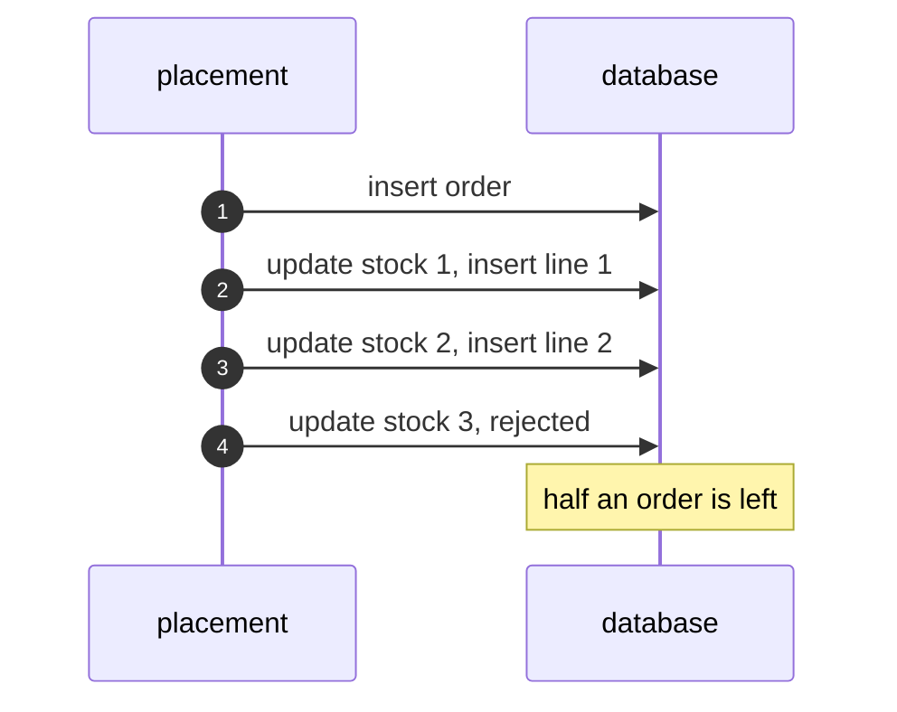
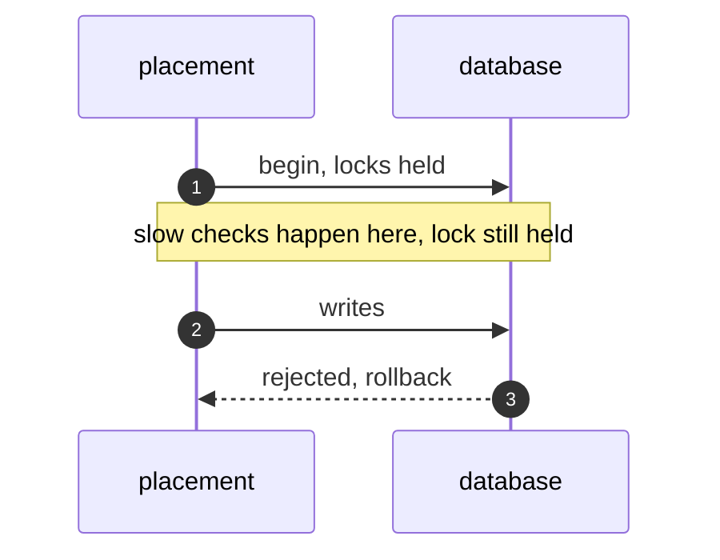
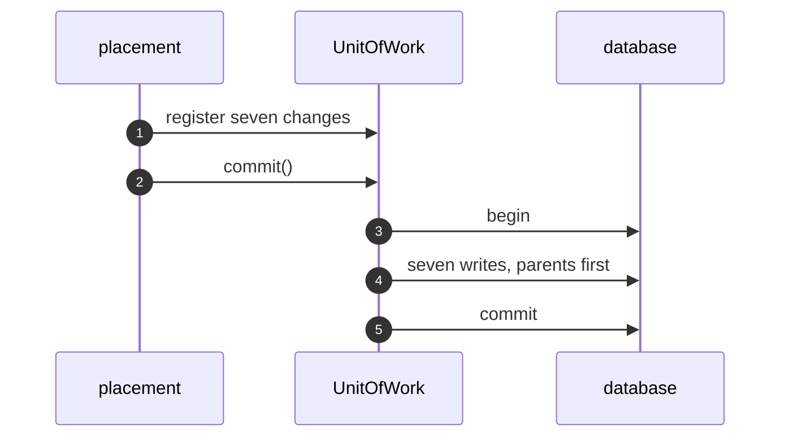
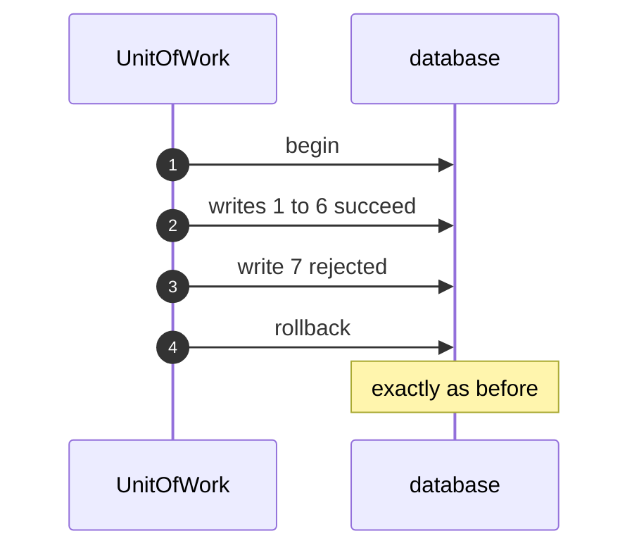

# Unit of Work Pattern — UML Sequence Diagrams

Four sequences.

## 1. Objects Save Themselves

Mermaid source

## 2. A Transaction Around It

Mermaid source

## 3. The Unit Of Work Commits

Mermaid source

## 4. A Failed Commit

Mermaid source

