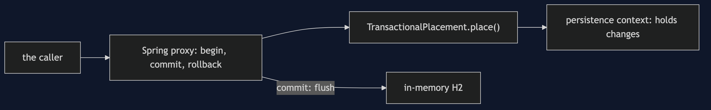
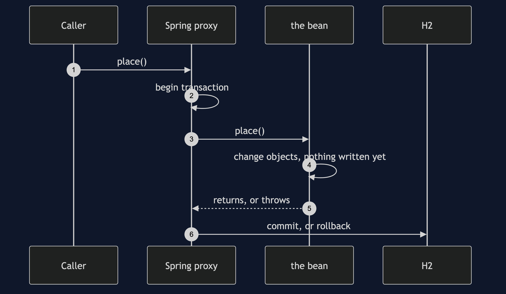

# Unit of Work with Spring Pattern

```
src/main/java/com/jk/explore/unitofworkspring/
├── OrderApplication.java            the Spring Boot entry point and the six acts
│
├── domain/                          ← the partner's order, as entities
│   ├── Product.java  CustomerOrder.java  OrderLine.java
│   └── StockFailure.java  StockFailureChecked.java   the same failure, two ways
└── service/
    ├── Shelf.java                    seeds, resets, and reads what is really committed
    ├── SelfSavingPlacement.java      no transaction around the order
    ├── TransactionalPlacement.java   @Transactional: the unit of work
    ├── CheckedFailurePlacement.java  the checked exception that commits anyway, and rollbackFor
    ├── FlushNobodyWrote.java         a query makes Hibernate write early
    └── SelfInvocation.java           the annotation that does nothing
```

**`@Transactional` is a unit of work: every change made inside the method is written when it returns, or none of them are.**

This project is the framework version of [Unit of Work](../unit-of-work-pattern). That project built the mechanism by hand: register changes, write at commit, roll back to nothing. This one puts the same three-line order, where the third stock update fails, through Spring. It does not re-teach the pattern. It shows the failures that are Spring's own: a checked exception that commits anyway, and a flush nobody wrote.

## Run

```bash
./gradlew run
```

Six acts. The partner project, Unit of Work, built the mechanism by hand. Here the same three-line order goes through `@Transactional`, and the failures are Spring's own. Every count comes from Hibernate's statistics.

```
UNIT OF WORK WITH SPRING — the flush you did not write

ONE. No transaction around the order — every step commits alone.
  the third stock update failed: the stock update for product 3 was rejected
  committed: orders 1, lines 2, stock keyboard 8, mouse 9, monitor 10
  the partner's first act, with Spring: half an order.

TWO. @Transactional — the unit of work is one annotation.
  inside the method, after changing three objects: inserts written 0, updates written 0.
  after the method returned: inserts written 2, updates written 1.
  the writes appeared at commit, not where the code is.
  the same failure as act one, now under @Transactional:
  committed: orders 0, lines 0, stock keyboard 10, mouse 10, monitor 10
  all of the order, or none of it.

THREE. The exception nobody expected to matter.
  the same failure, declared as a checked exception: the stock update for product 3 was rejected
  committed: orders 1, lines 2, stock keyboard 8, mouse 9, monitor 10
  under @Transactional, and half an order committed anyway.
  Spring rolls back on unchecked exceptions and errors. on checked ones it commits.

FOUR. The one-line fix: rollbackFor.
  @Transactional(rollbackFor = StockFailureChecked.class), same failure:
  committed: orders 0, lines 0, stock keyboard 10, mouse 10, monitor 10
  the default has to be overridden, in the annotation, by someone who knows.

FIVE. A flush nobody wrote.
  updates written before changing anything: 0
  after changing a product's stock:         0 (held back until commit)
  after running an unrelated query:         1 (Hibernate wrote it first)
  the write happened at a line that says nothing about writing.

SIX. The annotation that does nothing.
  placeViaThis() called placeLines(), which is @Transactional, through this. it threw:
  TransactionRequiredException: No EntityManager with actual transaction available for ...
  committed: orders 1, lines 0, stock keyboard 10, mouse 10, monitor 10
  the annotation was never seen. @Transactional works through a proxy, and a call on this skips it.
  where you have met this: every @Transactional method in a Spring application.
```

## Test

```bash
./gradlew test
```

2 test classes, 8 test methods, offline, each Spring context started inside the test, over in-memory H2.

## Technologies and versions

| What | Version | Why it is here |
| --- | --- | --- |
| Java | 21 | The repository standard, via the Gradle toolchain block |
| Gradle | 9.2.1 | The wrapper in this directory; no separate install needed |
| Spring Boot | 4.1.1 | The container: it wires the beans and supplies `@Transactional` |
| Hibernate ORM | from Spring Boot 4.1.1 | The JPA implementation underneath |
| H2 | from Spring Boot 4.1.1 | An in-memory database, so nothing is installed |
| JUnit 5 | 5.10.2 | Test runner |

No web starter. This project is about the transaction boundary, not HTTP. See [`docs/dependencies.md`](docs/dependencies.md).

## Learning Material

| Document | What it covers |
| --- | --- |
| [`docs/problem-statement.md`](docs/problem-statement.md) | The partner's order, and the annotation |
| [`docs/unit-of-work-with-spring-pattern-explained.md`](docs/unit-of-work-with-spring-pattern-explained.md) | What Spring adds, and where it surprises |
| [`docs/class-diagram.md`](docs/class-diagram.md) | The types |
| [`docs/architecture-diagram.md`](docs/architecture-diagram.md) | The proxy that owns the transaction |
| [`docs/data-flow-diagram.md`](docs/data-flow-diagram.md) | One call: commit, rollback, or half |
| [`docs/sequence-diagram.md`](docs/sequence-diagram.md) | Written for a listener with the screen off |
| [`docs/uml-diagram.md`](docs/uml-diagram.md) | Four sequences |
| [`docs/animation.html`](docs/animation.html) | The six acts in a browser |
| [`docs/prerequisites.md`](docs/prerequisites.md) | What you need to know |
| [`docs/session.md`](docs/session.md) | A one-hour taught session |
| [`docs/spec.md`](docs/spec.md) | The generated specification |
| [`docs/youtube.md`](docs/youtube.md) | Title, description and chapters |
| [`docs/dependencies.md`](docs/dependencies.md) | What Spring, Hibernate and H2 are, what they cost, and that skipping this project loses none of the pattern |

### The pattern in one picture


### Where each piece sits



### How one request moves


### Who calls whom, in order



### All four sequences


### Video

Built from [`video/scenes.py`](video/scenes.py) by
[`video/build_video.sh`](video/build_video.sh). The rendered file is not
committed; see the repository README for why.

## Where you have already met this

Every `@Transactional` method in a Spring application. The `TransactionRequiredException` in act six is one of the most common Spring errors there is.

## When this is too much

For a single write the annotation is not needed. It earns its place when one business action writes several rows together.

## Where this sits

This project pairs with [Unit of Work](../unit-of-work-pattern), and is the third of four framework projects in [`enterprise-design-patterns`](..).
