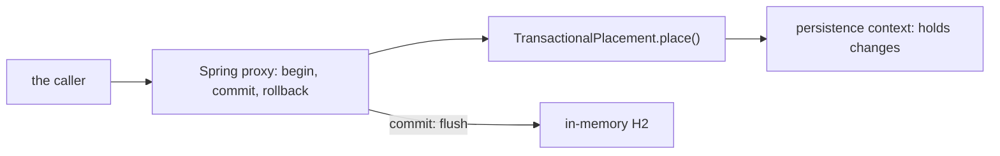

# Unit of Work with Spring Pattern — Architecture Diagram

Spring wraps the service in a proxy. The proxy owns the transaction.

Mermaid source

```mermaid
flowchart LR
    Caller["the caller"] --> Proxy["Spring proxy: begin, commit, rollback"]
    Proxy --> Bean["TransactionalPlacement.place()"]
    Bean --> EM["persistence context: holds changes"]
    Proxy -->|commit: flush| DB["in-memory H2"]
```

