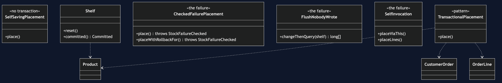
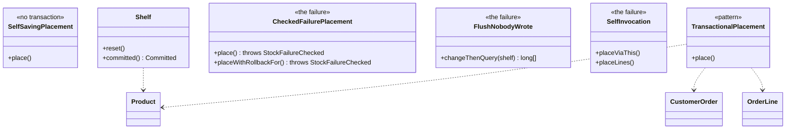

# Unit of Work with Spring Pattern — Class Diagram

Each service shows one way an order can be placed. The domain is the partner's.

Mermaid source

```mermaid
classDiagram
    class SelfSavingPlacement {
        <<no transaction>>
        +place()
    }
    class TransactionalPlacement {
        <<pattern>>
        +place()
    }
    class CheckedFailurePlacement {
        <<the failure>>
        +place() throws StockFailureChecked
        +placeWithRollbackFor() throws StockFailureChecked
    }
    class FlushNobodyWrote {
        <<the failure>>
        +changeThenQuery(shelf) long[]
    }
    class SelfInvocation {
        <<the failure>>
        +placeViaThis()
        +placeLines()
    }
    class Shelf {
        +reset()
        +committed() Committed
    }
    class Product
    class CustomerOrder
    class OrderLine
    TransactionalPlacement ..> Product
    TransactionalPlacement ..> CustomerOrder
    TransactionalPlacement ..> OrderLine
    Shelf ..> Product
```

