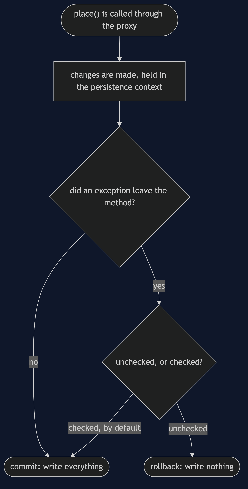
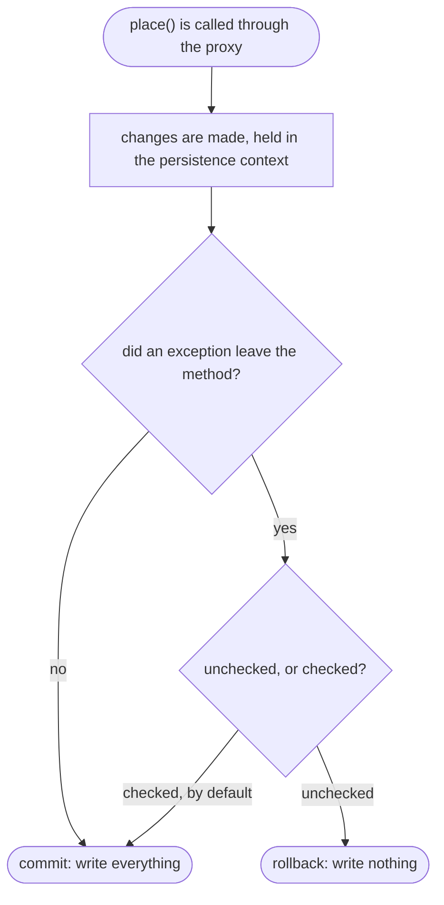

# Unit of Work with Spring Pattern — Data Flow Diagram

One `@Transactional` call: to commit, to rollback, or to commit half.

Mermaid source

```mermaid
flowchart TD
    Call(["place() is called through the proxy"])
    Run["changes are made, held in the persistence context"]
    Ex{"did an exception leave the method?"}
    Kind{"unchecked, or checked?"}
    Commit(["commit: write everything"])
    Roll(["rollback: write nothing"])
    Call --> Run --> Ex
    Ex -- no --> Commit
    Ex -- yes --> Kind
    Kind -- unchecked --> Roll
    Kind -- checked, by default --> Commit
```

