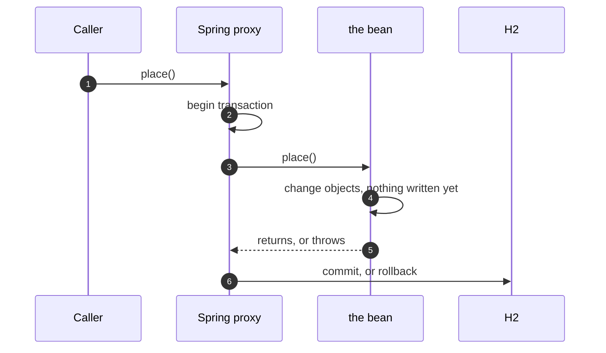

# Unit of Work with Spring Pattern — Sequence Diagram

Written for a listener with the screen off.

Say it in words. The caller calls place on the service, and Spring's proxy takes the call first. The proxy begins a transaction, then lets the method run. The method changes a product and adds an order and its lines, and none of it is written yet. If the method returns, the proxy commits, and everything is written at once. If an unchecked exception leaves the method, the proxy rolls back and nothing is written. If a checked one leaves, by default the proxy commits anyway.

Mermaid source

The load-bearing sentence: **the annotation hides the mechanism, and the mechanism still has rules.**
