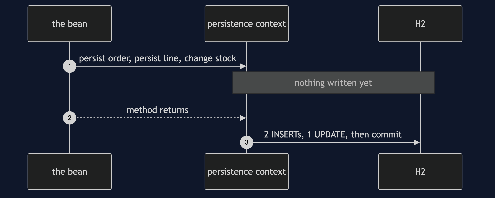
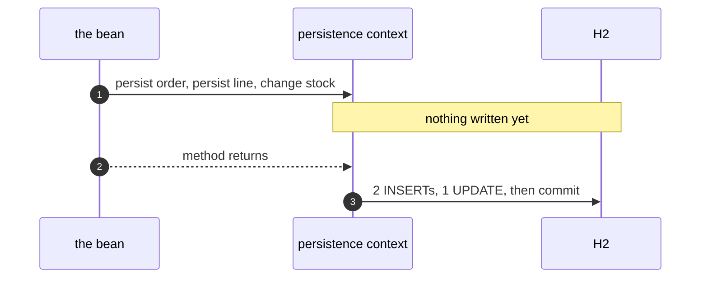
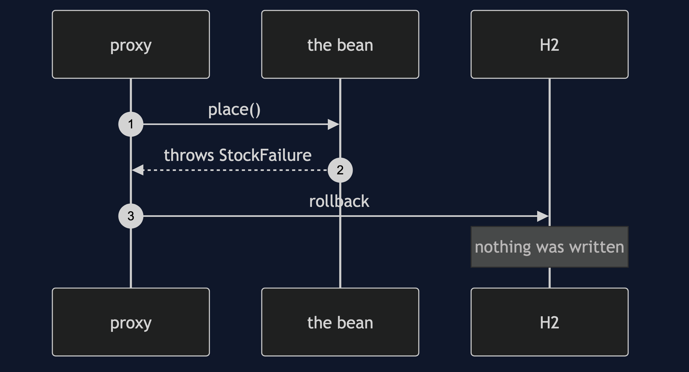
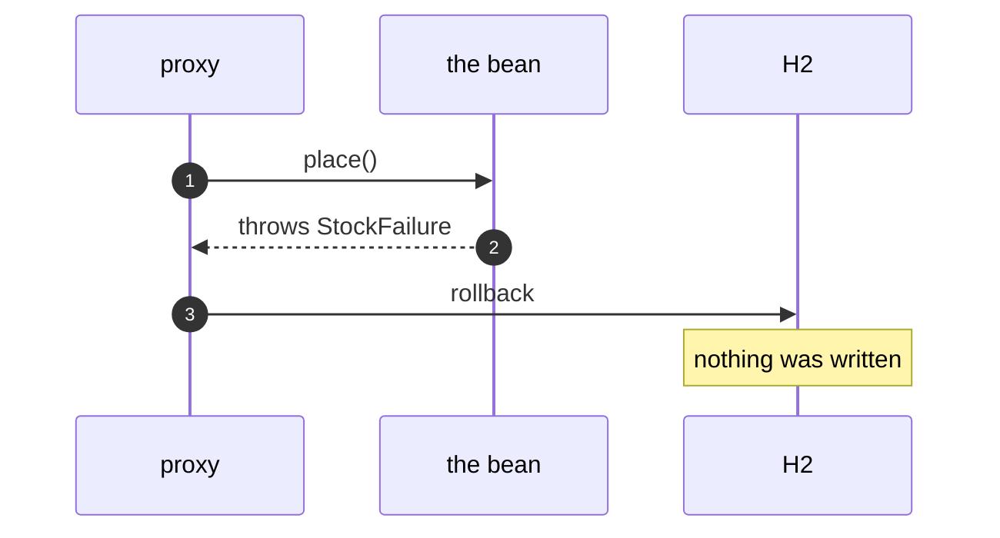
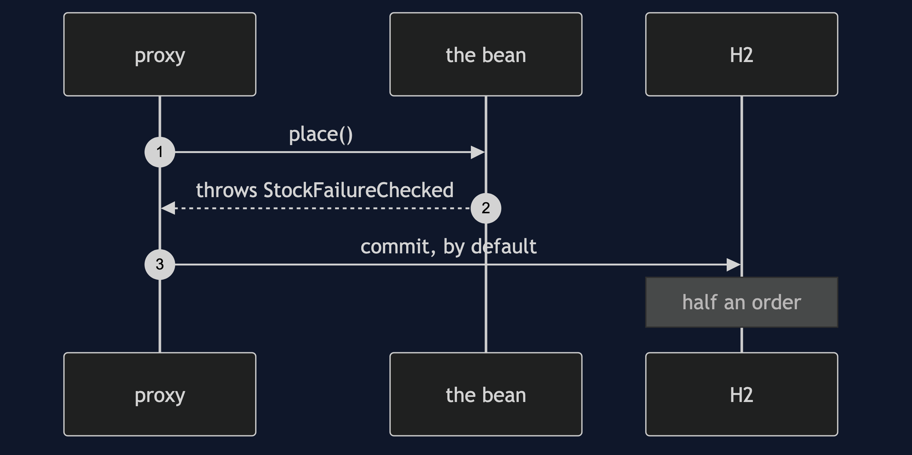
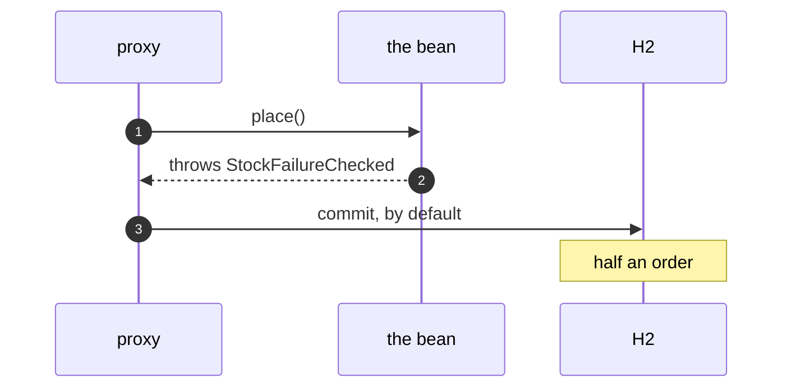
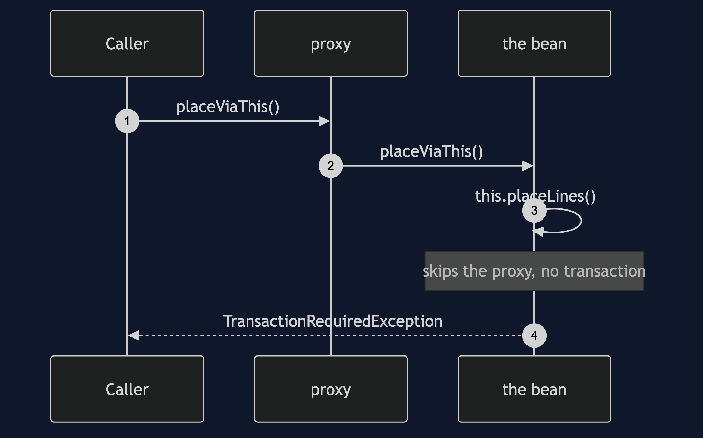
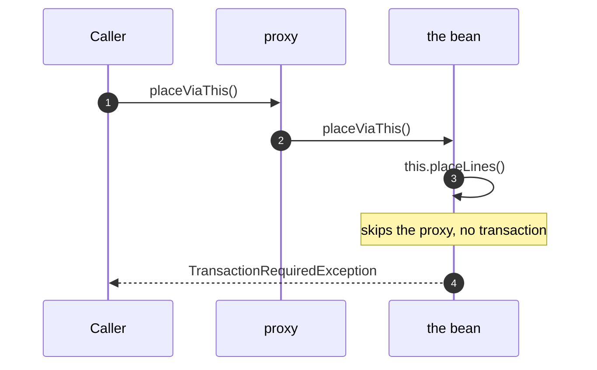

# Unit of Work with Spring Pattern — UML Sequence Diagrams

Four sequences.

## 1. Writes Appear At Commit

Mermaid source

## 2. An Unchecked Exception

Mermaid source

## 3. A Checked Exception

Mermaid source

## 4. A Call On This

Mermaid source

