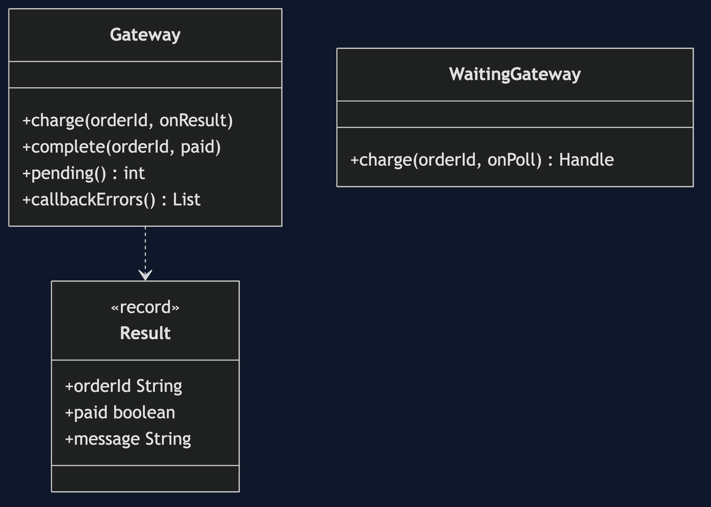
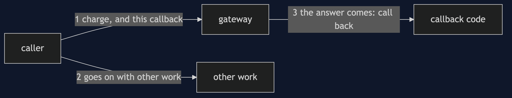
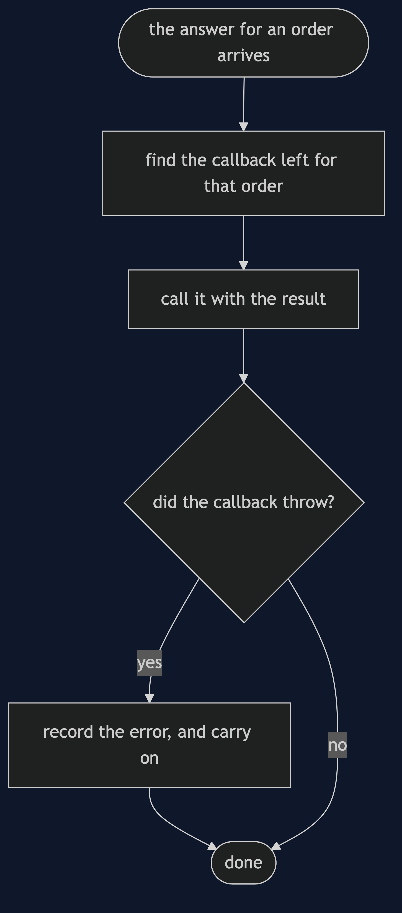
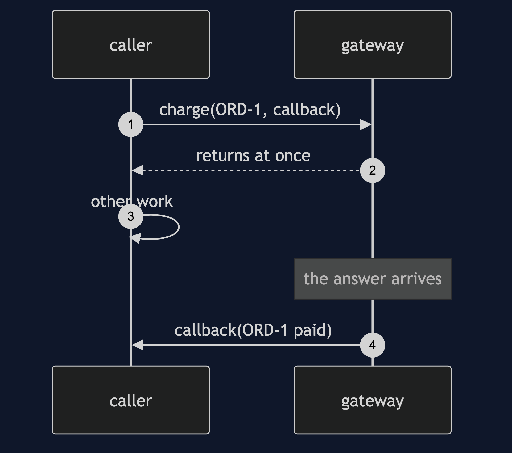
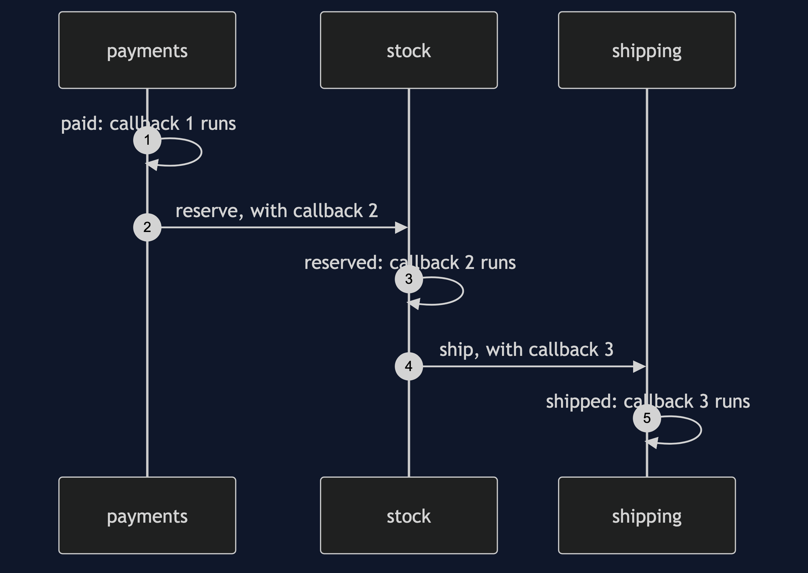

# Callback Pattern

```
src/main/java/com/jk/explore/callback/
├── CallbackDemo.java                the six acts
├── Gateway.java                     records a request; calls back when the answer is delivered
├── Result.java                      the order, paid or not, and a message
│
├── WaitingGateway.java              the caller asks again and again
└── SharedFieldShop.java             remembers the order in a field
```

**Callback: hand over code to run when the answer is ready, and get on with other work.**

This project is in [foundational-design-patterns](..). It is [Observer](../../behavioural/observer-pattern) with one listener and one event, and it is the base of [Guarded Suspension](../../concurrency-design-patterns/guarded-suspension-pattern)'s opposite: there you wait, here you are called.

## Run

```bash
./gradlew run
```

Six acts. Every number quoted below comes from this program's own output.

```
ONE. Ask, and keep asking.
  the answer arrived on the 5th look. looks made: 5, 4 of them found nothing.
  and the caller could do nothing else in that time.
TWO. Say what to do, and go on.
  [charge requested, and the caller goes on, caller does other work, callback: ORD-1 paid].
THREE. What happened decides what to do.
  one callback, told the result: [ORD-1: ship it, ORD-2: ask for another card].
FOUR. When the callback itself fails.
  the first callback threw. the gateway went on: [ORD-2 paid]. recorded: [ORD-1: the mail server was down].
  the one who asked never sees that exception, because it happened in someone else's call.
FIVE. Answers in another order.
  remembering the order in a field: [ORD-2 paid, ORD-2 paid]. both say ORD-2.
  each callback holding its own order id: [ORD-2 paid, ORD-1 paid]. the answers came in the other order, and each is right.
SIX. The bill.
  pay, then reserve, then ship: three callbacks, each inside the one before, three levels deep.
  the order the lines run in: [1. all asked for, first step only, 2. paid, 3. stock asked, 4. reserved, 5. next step asked, 6. shipped]. in the code, the line that asks stock is written below the block that ships, and it runs first. that is not the order they are written in.
  and every level needs its own handling for a failure, and each answer arrives with no stack that shows who asked.
```

## Test

```bash
./gradlew test
```

2 test classes, 7 test methods, offline, with nothing installed and no framework.

## Technologies and versions

| What | Version | Why it is here |
| --- | --- | --- |
| Java | 21 | The repository standard, via the Gradle toolchain block |
| Gradle | 9.2.1 | The wrapper in this directory; no separate install needed |
| JUnit 5 | 5.10.2 | Test runner |

No framework. A hand-built project stays plain Java so the mechanism is the whole lesson.

## Learning Material

| Document | What it covers |
| --- | --- |
| [`docs/problem-statement.md`](docs/problem-statement.md) | The scenario, and the problem |
| [`docs/callback-pattern-explained.md`](docs/callback-pattern-explained.md) | The pattern, and six acts |
| [`docs/class-diagram.md`](docs/class-diagram.md) | The types |
| [`docs/architecture-diagram.md`](docs/architecture-diagram.md) | The parts and how they connect |
| [`docs/data-flow-diagram.md`](docs/data-flow-diagram.md) | What happens to one request |
| [`docs/sequence-diagram.md`](docs/sequence-diagram.md) | Written for a listener with the screen off |
| [`docs/uml-diagram.md`](docs/uml-diagram.md) | Four sequences |
| [`docs/animation.html`](docs/animation.html) | The six acts in a browser |
| [`docs/prerequisites.md`](docs/prerequisites.md) | What you need to know |
| [`docs/session.md`](docs/session.md) | A one-hour taught session |
| [`docs/spec.md`](docs/spec.md) | The generated specification |
| [`docs/youtube.md`](docs/youtube.md) | Title, description and chapters |

### The pattern in one picture



### Where each piece sits



### How one request moves



### Who calls whom, in order



### All four sequences




### Video

Built from [`video/scenes.py`](video/scenes.py) by
[`video/build_video.sh`](video/build_video.sh). The rendered file is not
committed; see the repository README for why.

## Where you have already met this

Every GUI toolkit's button handlers, Node.js's I/O API, payment and webhook integrations, and `CompletableFuture`.

## When this is too much

For work that is quick, a plain return value is simpler. For chains of steps, futures or coroutines read better than nested callbacks.

## Where this sits

This project is in [`foundational-design-patterns`](..), and is meant to be read with its neighbours there.
