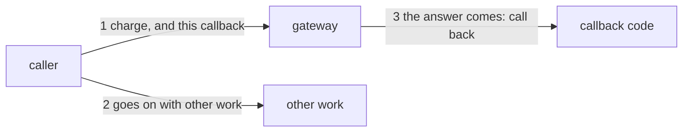

# Callback Pattern — Architecture Diagram

The caller leaves code with the gateway, and goes on.

Mermaid source

```mermaid
flowchart LR
    C["caller"] -->|1 charge, and this callback| G["gateway"]
    C -->|2 goes on with other work| W["other work"]
    G -->|3 the answer comes: call back| CB["callback code"]
```

