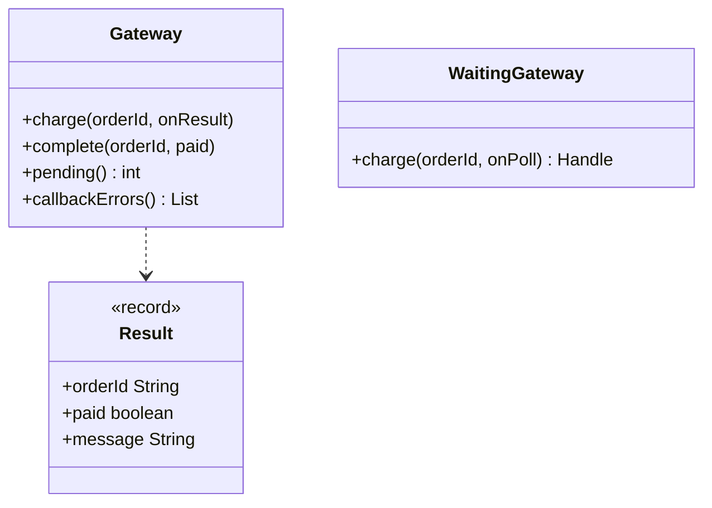

# Callback Pattern — Class Diagram

A gateway that remembers who to call back.

Mermaid source

```mermaid
classDiagram
    class Gateway {
        +charge(orderId, onResult)
        +complete(orderId, paid)
        +pending() int
        +callbackErrors() List
    }
    class Result {
        <<record>>
        +orderId String
        +paid boolean
        +message String
    }
    class WaitingGateway {
        +charge(orderId, onPoll) Handle
    }
    Gateway ..> Result
```

