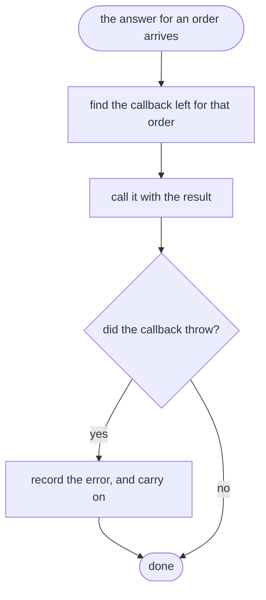

# Callback Pattern — Data Flow Diagram

What happens when the answer arrives.

Mermaid source

```mermaid
flowchart TD
    Answer(["the answer for an order arrives"])
    Find["find the callback left for that order"]
    Call["call it with the result"]
    Threw{"did the callback throw?"}
    Rec["record the error, and carry on"]
    Done(["done"])
    Answer --> Find --> Call --> Threw
    Threw -- yes --> Rec --> Done
    Threw -- no --> Done
```

