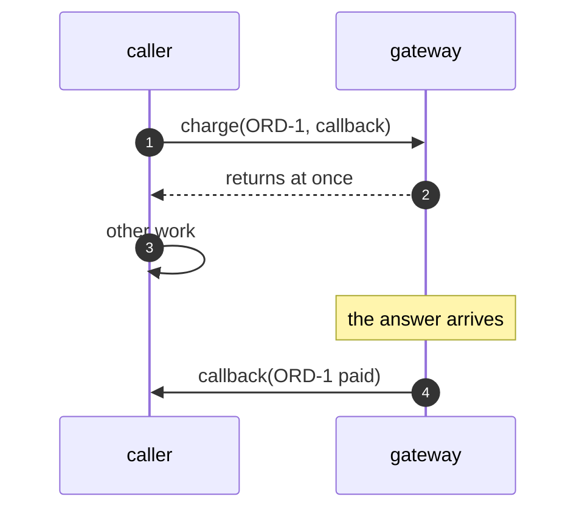

# Callback Pattern — Sequence Diagram

Written for a listener with the screen off.

Say it in words. The caller asks the gateway to charge order one, and hands over a piece of code. The gateway writes it down, and returns at once. The caller does other work. Later the answer comes, and the gateway calls the piece of code with the result: paid. The code decides what to do next.

Mermaid source

The load-bearing sentence: **the callback runs later, when the answer is ready.**
