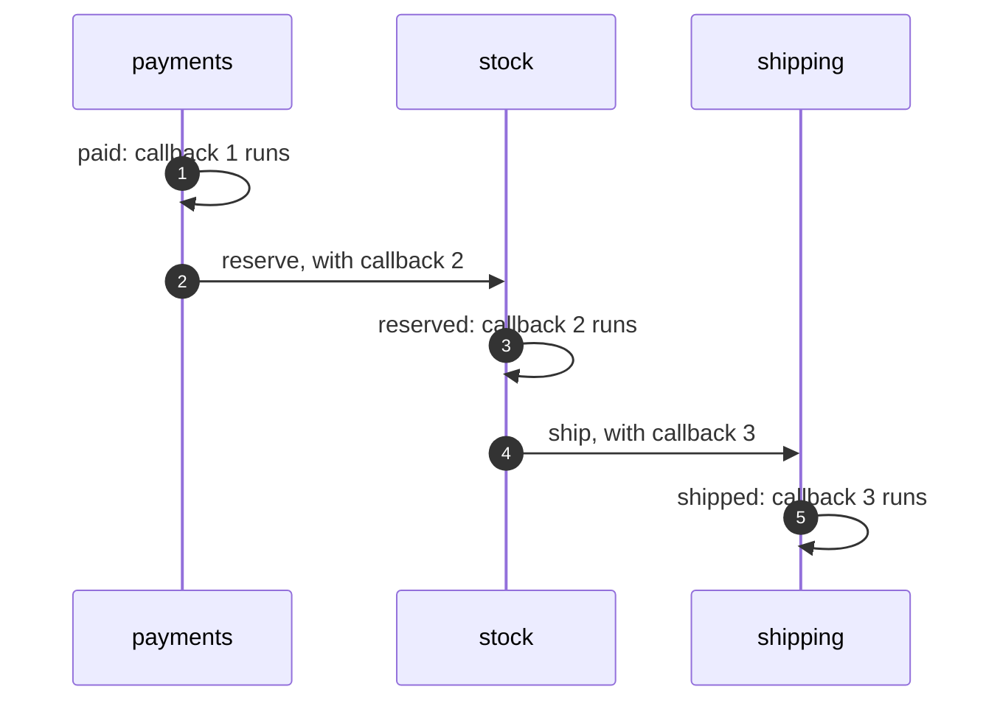

# Callback Pattern — UML Sequence Diagrams

Four sequences.

## 1. Nested Callbacks

Mermaid source

```mermaid
sequenceDiagram
    autonumber
    participant P as payments
    participant S as stock
    participant H as shipping
    P->>P: paid: callback 1 runs
    P->>S: reserve, with callback 2
    S->>S: reserved: callback 2 runs
    S->>H: ship, with callback 3
    H->>H: shipped: callback 3 runs
```

