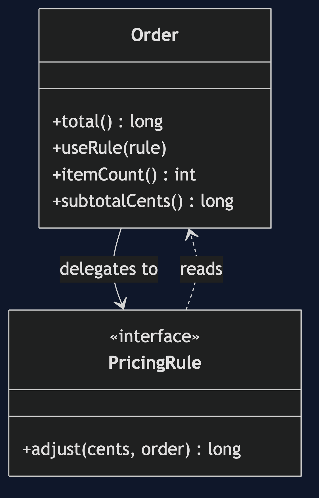
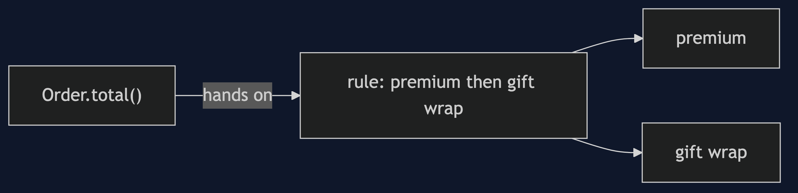
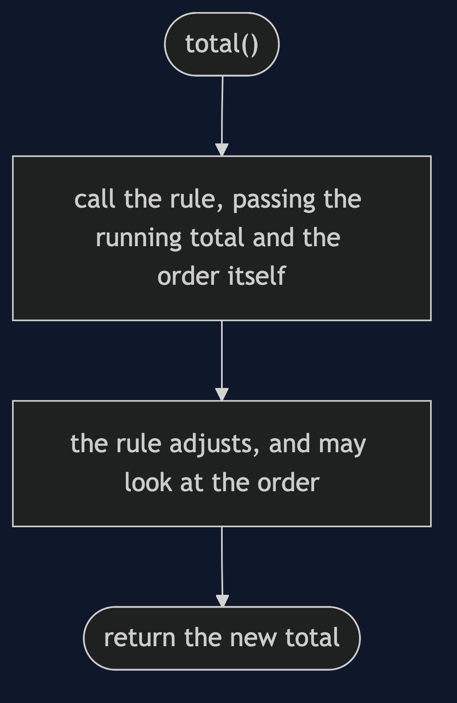
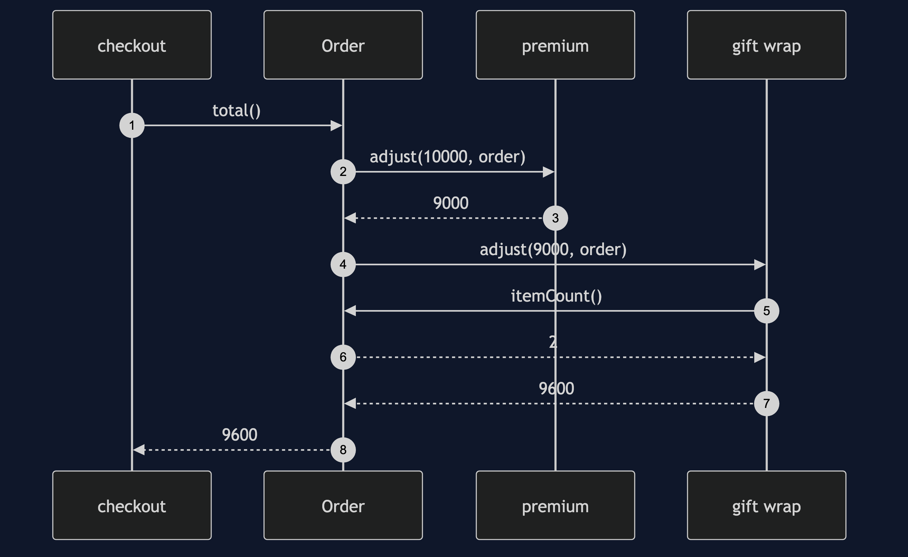
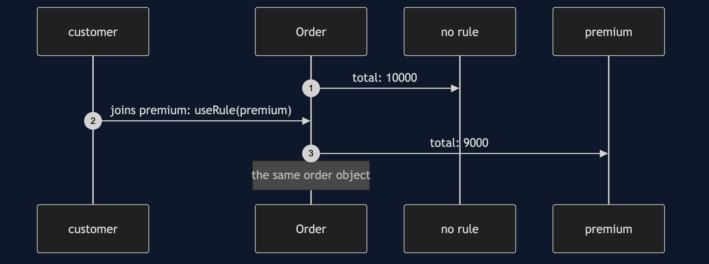

# Delegation Pattern

```
src/main/java/com/jk/explore/delegation/
├── DelegationDemo.java              the six acts
├── Order.java                       holds a PricingRule, and hands total() to it
├── PricingRule.java                 the helper: none, premium, gift wrap, in order
├── Shipping.java                    a helper with four methods
├── OrderWithShipping.java           forwards each of the four
│
└── naive/
    ├── PlainOrder.java              the inheritance version
    ├── PremiumOrder.java
    ├── GiftOrder.java
    └── PremiumGiftOrder.java
```

**Delegation: hand a job to a helper object you hold, and can swap.**

This project is in [foundational-design-patterns](..). It is the idea under [Strategy](../../behavioural/strategy-pattern), [Decorator](../../structural/decorator-pattern) and [Proxy](../../structural/proxy-pattern), and the rule of thumb behind favouring composition over inheritance.

## Run

```bash
./gradlew run
```

Six acts. Every number quoted below comes from this program's own output.

```
ONE. A subclass for each way of pricing.
  premium, gift wrap, and both: 4 classes for 2 features. a third feature would need 8.
  premium and gift order: 9600. and an order cannot change its class once it exists.
TWO. The order hands the pricing on.
  one Order class. no rule 10000, premium 9000, gift wrap 10600.
THREE. Change the helper while it lives.
  the customer joins the premium plan while shopping. the same order object: 10000 then 9000.
FOUR. Two helpers at once.
  premium then gift wrap: 9600, the same as the class made for both. classes added: 0.
FIVE. The helper needs to see the order.
  gift wrap is 300 for each item, so it must look at the order it was called for. 2 items: 10600. 3 items: 10900.
  that is why the order passes itself in: the helper is a different object, and does not know which order it is helping.
SIX. The bill.
  one total() made 3 calls to helpers, where inheritance made none: one more hop for every helper.
  to look like a helper with 4 methods, the order had to write 4 forwarding methods that only pass the call on.
  and a helper knows nothing of its owner unless it is told: it cannot call a method on the order that the order did not pass in.
```

## Test

```bash
./gradlew test
```

2 test classes, 7 test methods, offline, with nothing installed and no framework.

## Technologies and versions

| What | Version | Why it is here |
| --- | --- | --- |
| Java | 21 | The repository standard, via the Gradle toolchain block |
| Gradle | 9.2.1 | The wrapper in this directory; no separate install needed |
| JUnit 5 | 5.10.2 | Test runner |

No framework. A hand-built project stays plain Java so the mechanism is the whole lesson.

## Learning Material

| Document | What it covers |
| --- | --- |
| [`docs/problem-statement.md`](docs/problem-statement.md) | The scenario, and the problem |
| [`docs/delegation-pattern-explained.md`](docs/delegation-pattern-explained.md) | The pattern, and six acts |
| [`docs/class-diagram.md`](docs/class-diagram.md) | The types |
| [`docs/architecture-diagram.md`](docs/architecture-diagram.md) | The parts and how they connect |
| [`docs/data-flow-diagram.md`](docs/data-flow-diagram.md) | What happens to one request |
| [`docs/sequence-diagram.md`](docs/sequence-diagram.md) | Written for a listener with the screen off |
| [`docs/uml-diagram.md`](docs/uml-diagram.md) | Four sequences |
| [`docs/animation.html`](docs/animation.html) | The six acts in a browser |
| [`docs/prerequisites.md`](docs/prerequisites.md) | What you need to know |
| [`docs/session.md`](docs/session.md) | A one-hour taught session |
| [`docs/spec.md`](docs/spec.md) | The generated specification |
| [`docs/youtube.md`](docs/youtube.md) | Title, description and chapters |

### The pattern in one picture



### Where each piece sits



### How one request moves



### Who calls whom, in order



### All four sequences




### Video

Built from [`video/scenes.py`](video/scenes.py) by
[`video/build_video.sh`](video/build_video.sh). The rendered file is not
committed; see the repository README for why.

## Where you have already met this

Almost every framework's plugin points, Java's `Iterator` and `Comparator` in use, and the phrase composition over inheritance.

## When this is too much

If there is one fixed way of doing a job, do it directly. Delegation pays off when a job varies, or must change at run time.

## Where this sits

This project is in [`foundational-design-patterns`](..), and is meant to be read with its neighbours there.
