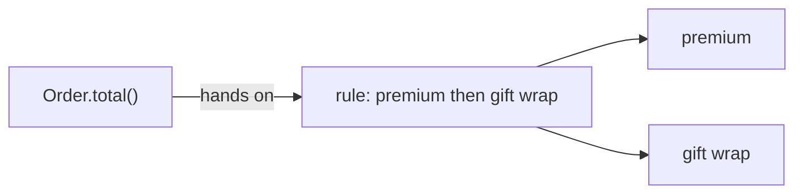

# Delegation Pattern — Architecture Diagram

The order does not price. Its helper does. Helpers can be chained.

Mermaid source

```mermaid
flowchart LR
    O["Order.total()"] -->|hands on| R["rule: premium then gift wrap"]
    R --> P["premium"]
    R --> G["gift wrap"]
```

