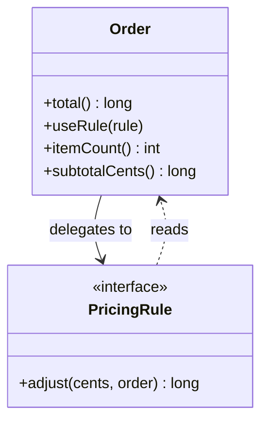

# Delegation Pattern — Class Diagram

An order that holds a rule, and the rule it hands its total to.

Mermaid source

```mermaid
classDiagram
    class Order {
        +total() long
        +useRule(rule)
        +itemCount() int
        +subtotalCents() long
    }
    class PricingRule {
        <<interface>>
        +adjust(cents, order) long
    }
    Order --> PricingRule : delegates to
    PricingRule ..> Order : reads
```

