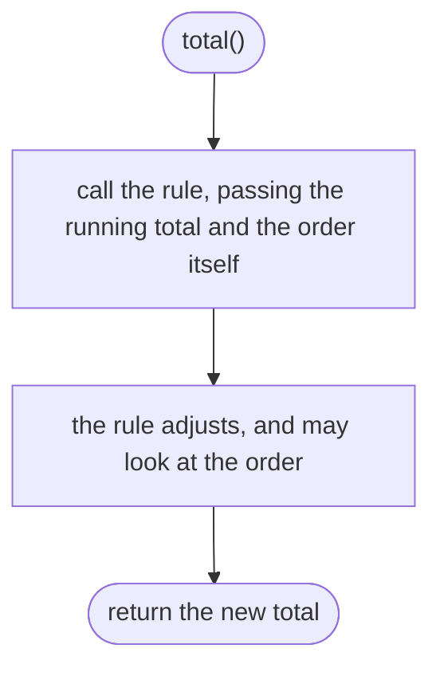

# Delegation Pattern — Data Flow Diagram

What total() does.

Mermaid source

```mermaid
flowchart TD
    Ask(["total()"])
    Pass["call the rule, passing the running total and the order itself"]
    Rule["the rule adjusts, and may look at the order"]
    Ret(["return the new total"])
    Ask --> Pass --> Rule --> Ret
```

