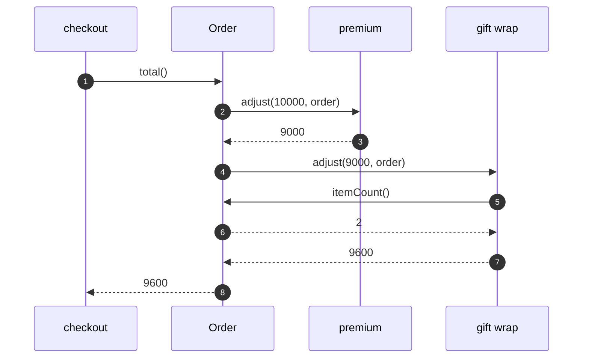

# Delegation Pattern — Sequence Diagram

Written for a listener with the screen off.

Say it in words. The checkout asks the order for its total. The order does not work it out. It hands the subtotal and itself to its rule. The premium rule takes off ten percent. The gift wrap rule asks the order how many items, and adds three hundred for each. The order returns the result.

Mermaid source

The load-bearing sentence: **the order hands the job on, and the helper may ask the order back.**
