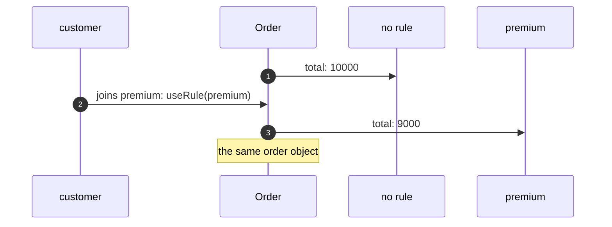

# Delegation Pattern — UML Sequence Diagrams

Four sequences.

## 1. Swapping The Helper

Mermaid source

```mermaid
sequenceDiagram
    autonumber
    participant C as customer
    participant O as Order
    participant N as no rule
    participant P as premium
    O->>N: total: 10000
    C->>O: joins premium: useRule(premium)
    O->>P: total: 9000
    Note over O: the same order object
```

