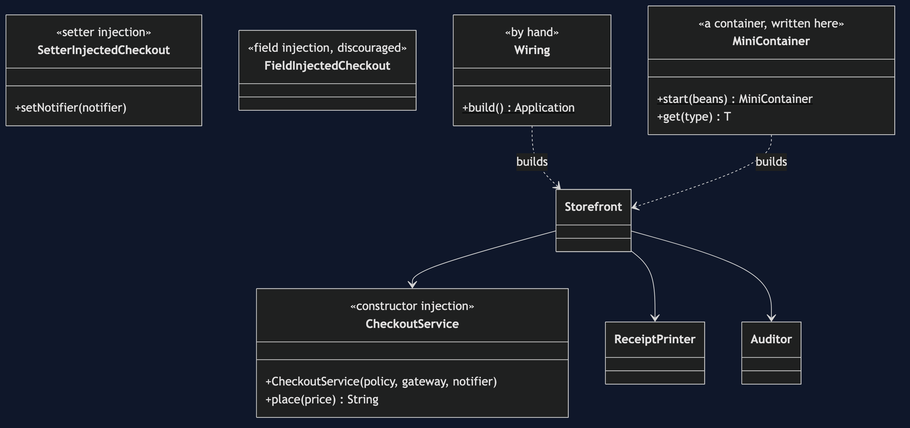
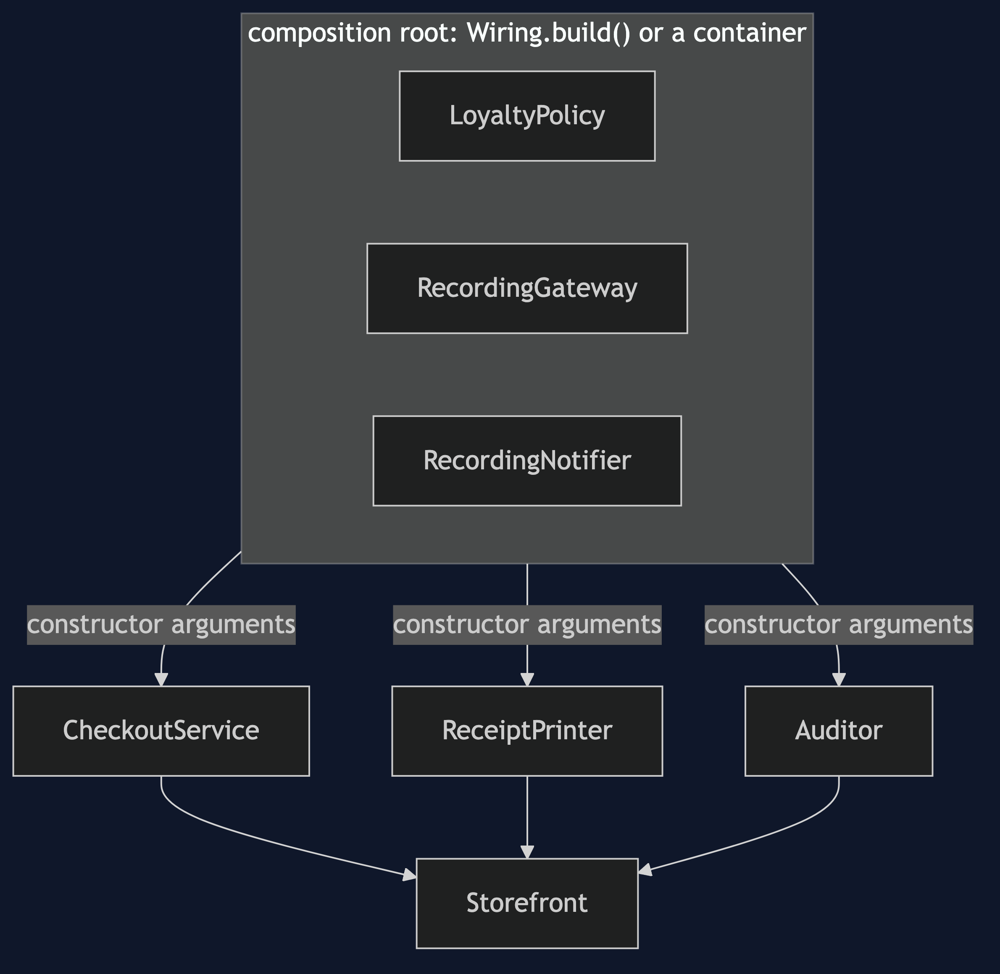
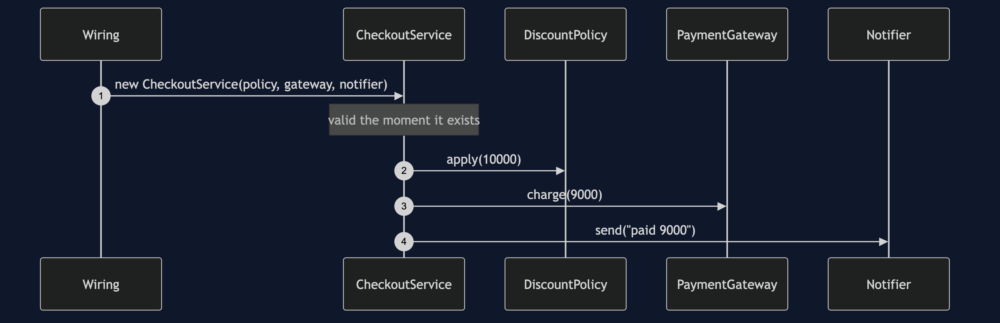

# Dependency Injection Pattern

```
src/main/java/com/jk/explore/dependencyinjection/
├── WiringDemo.java                  composition root — the six acts
│
├── domain/                          ← the same three collaborators as the neighbouring projects
│   ├── DiscountPolicy.java  LoyaltyPolicy.java
│   ├── PaymentGateway.java  RecordingGateway.java
│   └── Notifier.java  RecordingNotifier.java
├── app/                             ← classes that are given what they need
│   ├── CheckoutService.java          constructor injection: the signature is the dependency list
│   ├── ReceiptPrinter.java  Auditor.java  Storefront.java
│   └── OverloadedService.java        seven collaborators: a design smell
├── wiring/
│   └── Wiring.java                   the whole application, built by hand
├── forms/
│   ├── SetterInjectedCheckout.java   for genuinely optional things
│   └── FieldInjectedCheckout.java    discouraged, and why
└── container/                       ← what a container does, written here
    ├── MiniContainer.java            builds the graph from constructor parameter types
    ├── Injector.java                 field injection by reflection
    └── ContainerFailure.java  Chicken.java  Egg.java   start-up failures
```

**Dependency injection: a class declares what it needs in its constructor and is given it. It never looks anything up.**

This is the last of five projects in [foundational-design-patterns](..), and it closes an argument. [Registry](../registry-pattern) put things in a known place. [Service Locator](../service-locator-pattern) made a middleman that could find them. Dependency Injection stops the class asking at all. All three use the same three collaborators. Dependency injection is not Spring: the wiring is shown by hand first, and a small container is written here, so a container is something you have seen built, not something you take on trust.

## Run

```bash
./gradlew run
```

Six acts. The same three collaborators as Registry and Service Locator, so all three can be compared directly.

```
DEPENDENCY INJECTION — stop asking; be given

ONE. The signature is the dependency list.
  CheckoutService(DiscountPolicy, PaymentGateway, Notifier)
  that is everything it needs: complete, and checked by the compiler.
  new CheckoutService() does not compile. there is no way to forget a collaborator.
  it never looks anything up, so nothing is hidden, and it is valid the moment it exists.

TWO. The wiring, by hand, before any framework.
  the whole application is built in 9 lines of plain Java (blank lines included), in one place.
  it ran: charged [9000], messages sent 3.
  a container is an optimisation of something you can write yourself.

THREE. Three forms: constructor, setter, field.
  setter: for genuinely optional things. no notifier was set, and the order still worked: [9000]
  field: new FieldInjectedCheckout() compiled, and is invalid. placing an order threw NullPointerException.
  it only works once something reaches into its private fields by reflection: receipt-1
  recommendation: constructor injection. mandatory, visible, and valid on creation.

FOUR. A container, written here, in 86 lines.
  it read each constructor's parameter types and built the same graph as the hand wiring.
  charged [9000], the same as before.
  that is all Spring, Guice and Dagger do, plus scanning, scopes and a great deal of polish.

FIVE. The bill.
  a bean missing, when the container starts:
  could not construct CheckoutService: no bean for its parameter of type Notifier
  a circular dependency, when the container starts:
  circular dependency: Chicken -> Egg -> Chicken
  better than Service Locator: it fails at start-up, not on the first order. still not at compile time.
  and a class whose constructor takes 7 things has a design problem no injection style fixes.
  by hand the wiring grows with the application. that is what a container is for.

SIX. The progression, and the verdict.
  Registry put things in a known place. Service Locator made a middleman that could find them.
  Dependency Injection stopped the class asking at all.
  verdict: use constructor injection, by hand until the wiring hurts, then a container.
  dependency injection is not Spring. you have just done it in plain Java.
  where you have met this: @Component and a constructor parameter, in Spring; @Inject in Guice and Dagger.
```

## Test

```bash
./gradlew test
```

2 test classes, 10 test methods, offline, with nothing installed and no framework.

## Technologies and versions

| What | Version | Why it is here |
| --- | --- | --- |
| Java | 21 | The repository standard, via the Gradle toolchain block |
| Gradle | 9.2.1 | The wrapper in this directory; no separate install needed |
| JUnit 5 | 5.10.2 | Test runner |

No framework. A hand-built project stays plain Java so the mechanism is the whole lesson.

## Learning Material

| Document | What it covers |
| --- | --- |
| [`docs/problem-statement.md`](docs/problem-statement.md) | The same checkout, one more time |
| [`docs/dependency-injection-pattern-explained.md`](docs/dependency-injection-pattern-explained.md) | The pattern, three forms, a container written here, and the verdict |
| [`docs/class-diagram.md`](docs/class-diagram.md) | The types |
| [`docs/architecture-diagram.md`](docs/architecture-diagram.md) | One place builds; everything else is given |
| [`docs/data-flow-diagram.md`](docs/data-flow-diagram.md) | How a container builds a bean, and where it fails |
| [`docs/sequence-diagram.md`](docs/sequence-diagram.md) | Written for a listener with the screen off |
| [`docs/uml-diagram.md`](docs/uml-diagram.md) | Four sequences |
| [`docs/animation.html`](docs/animation.html) | The six acts in a browser |
| [`docs/prerequisites.md`](docs/prerequisites.md) | What you need to know |
| [`docs/session.md`](docs/session.md) | A one-hour taught session |
| [`docs/spec.md`](docs/spec.md) | The generated specification |
| [`docs/youtube.md`](docs/youtube.md) | Title, description and chapters |

### The pattern in one picture



### Where each piece sits



### How one request moves


### Who calls whom, in order



### All four sequences


### Video

Built from [`video/scenes.py`](video/scenes.py) by
[`video/build_video.sh`](video/build_video.sh). The rendered file is not
committed; see the repository README for why.

## Where you have already met this

In every Spring Boot application, where constructor parameters and `@Component` do what `Wiring.build()` does by hand. `@Inject` does the same in Guice and Dagger.

## When this is too much

Never for the idea. A container is too much for a small application that fits in `main`.

## Where this sits

This is the last of five projects in [`foundational-design-patterns`](..). It closes the argument begun in [Registry](../registry-pattern) and continued in [Service Locator](../service-locator-pattern).

## Also available with a framework

[Dependency Injection with Spring Pattern](../dependency-injection-with-spring-pattern) reruns this idea on a real framework, and shows what the framework adds and where it can undo the pattern. Watch this project first.
