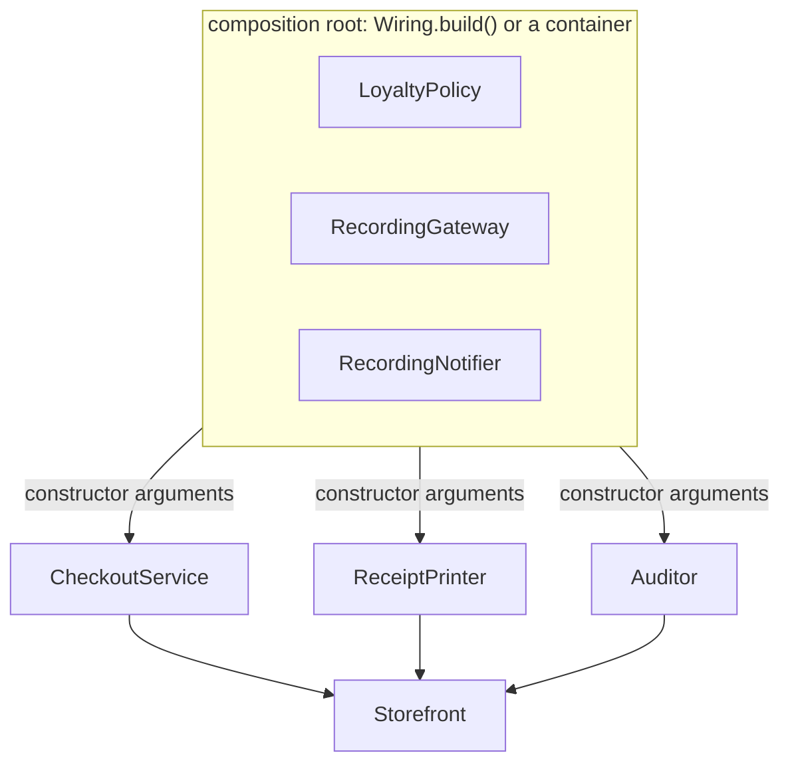

# Dependency Injection Pattern — Architecture Diagram

One place builds the graph. Everything else is given what it needs.

Mermaid source

```mermaid
flowchart TB
    subgraph Root["composition root: Wiring.build() or a container"]
        P["LoyaltyPolicy"]
        G["RecordingGateway"]
        N["RecordingNotifier"]
    end
    Root -->|constructor arguments| CS["CheckoutService"]
    Root -->|constructor arguments| RP["ReceiptPrinter"]
    Root -->|constructor arguments| AU["Auditor"]
    CS --> SF["Storefront"]
    RP --> SF
    AU --> SF
```

