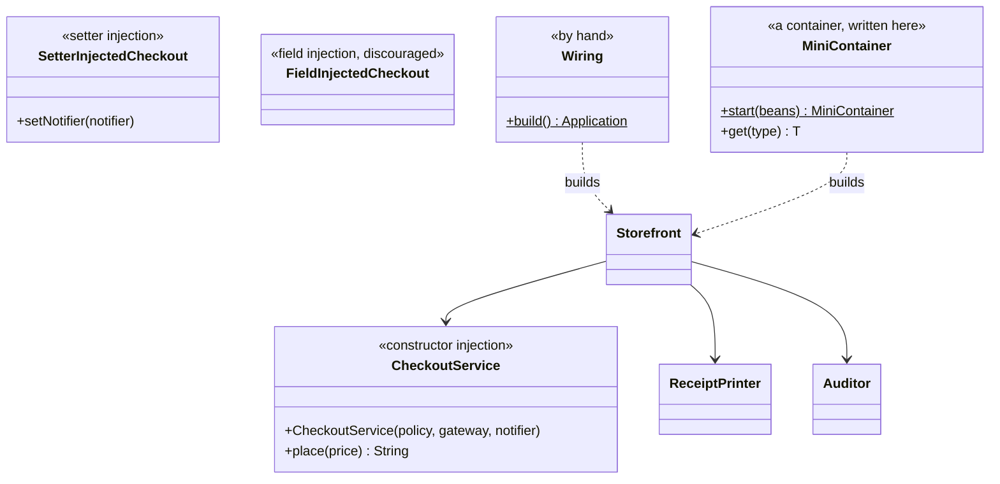

# Dependency Injection Pattern — Class Diagram

`CheckoutService` is given everything. Nothing in it looks anything up.

Mermaid source

```mermaid
classDiagram
    class CheckoutService {
        <<constructor injection>>
        +CheckoutService(policy, gateway, notifier)
        +place(price) String
    }
    class SetterInjectedCheckout {
        <<setter injection>>
        +setNotifier(notifier)
    }
    class FieldInjectedCheckout {
        <<field injection, discouraged>>
    }
    class Wiring {
        <<by hand>>
        +build()$ Application
    }
    class MiniContainer {
        <<a container, written here>>
        +start(beans)$ MiniContainer
        +get(type) T
    }
    class Storefront
    class ReceiptPrinter
    class Auditor
    Storefront --> CheckoutService
    Storefront --> ReceiptPrinter
    Storefront --> Auditor
    Wiring ..> Storefront : builds
    MiniContainer ..> Storefront : builds
```

