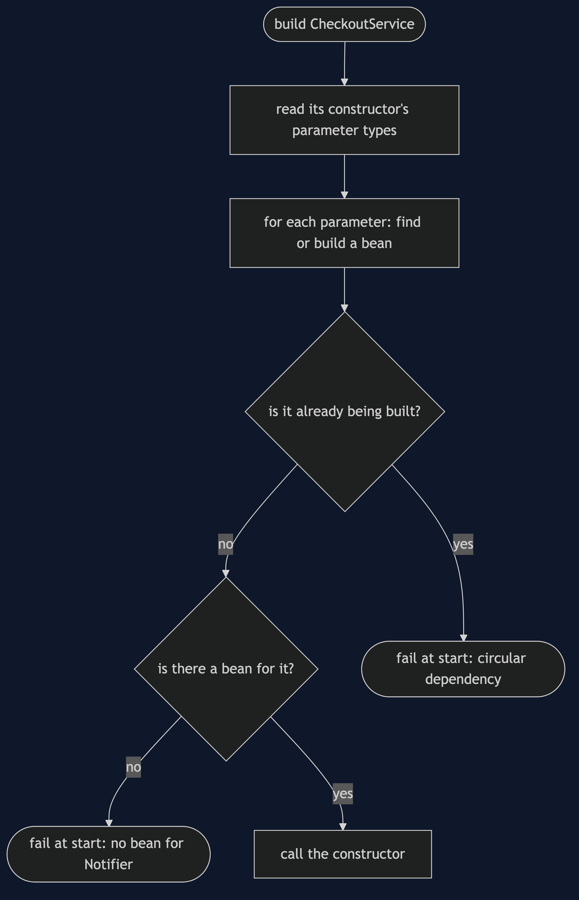
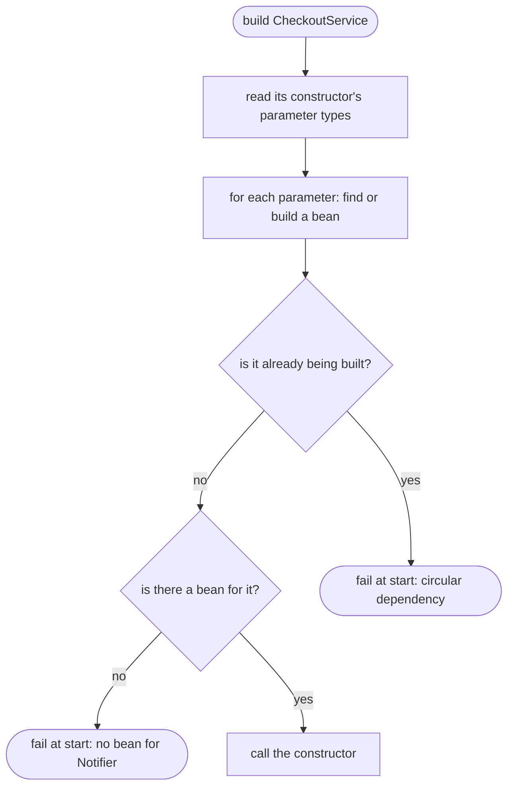

# Dependency Injection Pattern — Data Flow Diagram

How a container builds one bean, and where it can fail.

Mermaid source

```mermaid
flowchart TD
    Start(["build CheckoutService"])
    Ctor["read its constructor's parameter types"]
    Each["for each parameter: find or build a bean"]
    Have{"is there a bean for it?"}
    Loop{"is it already being built?"}
    Call["call the constructor"]
    Missing(["fail at start: no bean for Notifier"])
    Circular(["fail at start: circular dependency"])
    Start --> Ctor --> Each --> Loop
    Loop -- yes --> Circular
    Loop -- no --> Have
    Have -- no --> Missing
    Have -- yes --> Call
```

