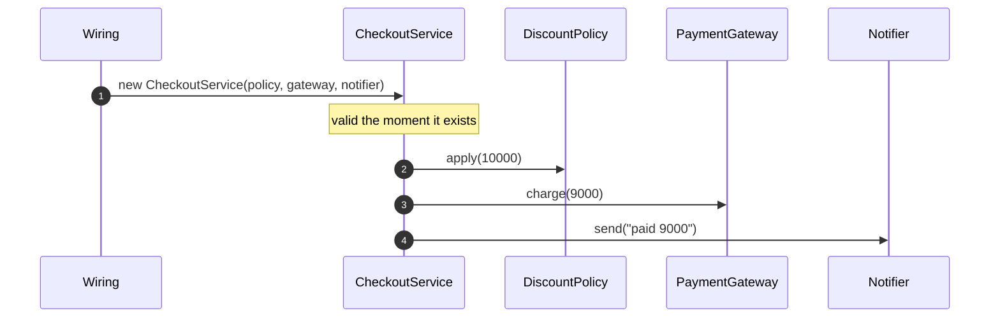

# Dependency Injection Pattern — Sequence Diagram

Written for a listener with the screen off.

Say it in words. The application starts. The one place that wires things together builds the policy, the gateway and the notifier. It then builds the checkout service, handing it those three in its constructor. The checkout service never asks for anything. Later a customer places an order. The checkout service applies the policy, charges the gateway and tells the notifier, using exactly the objects it was given. If a collaborator had been missing, this would not have compiled.

Mermaid source

The load-bearing sentence: **the signature is the dependency list, complete and checked by the compiler.**
