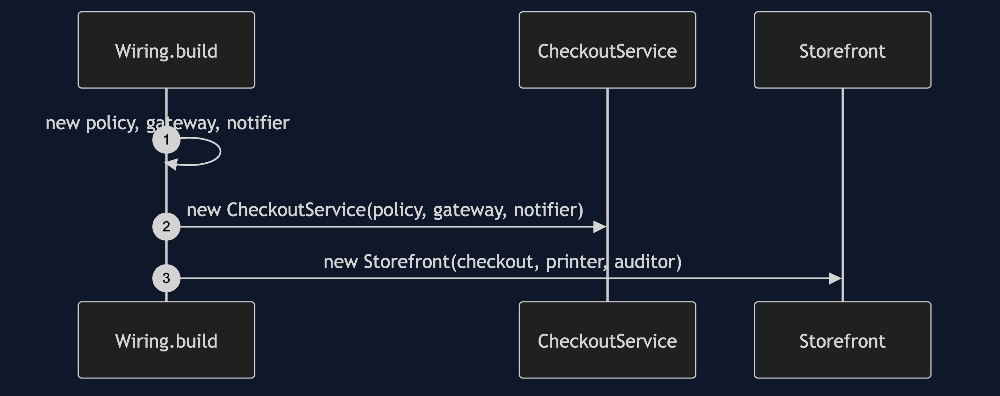
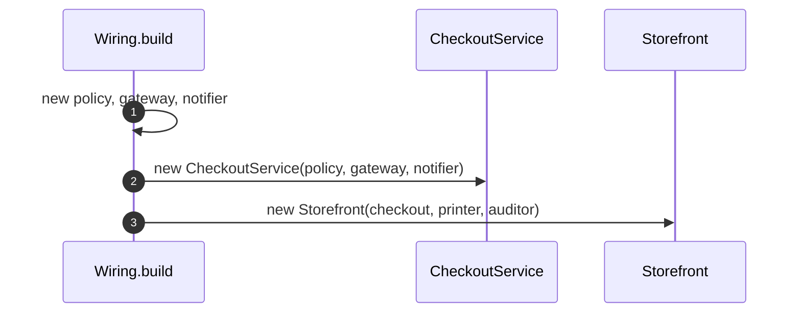
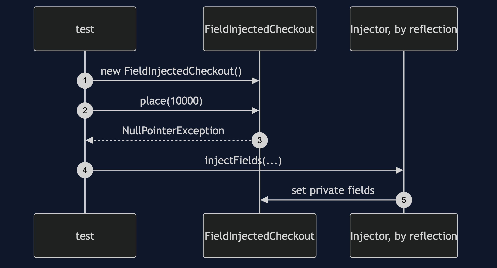
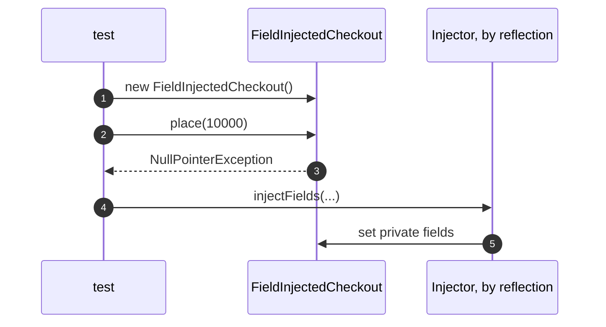
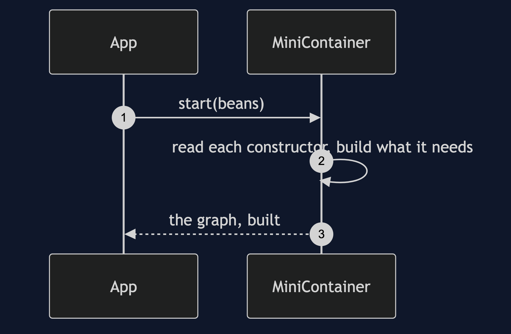
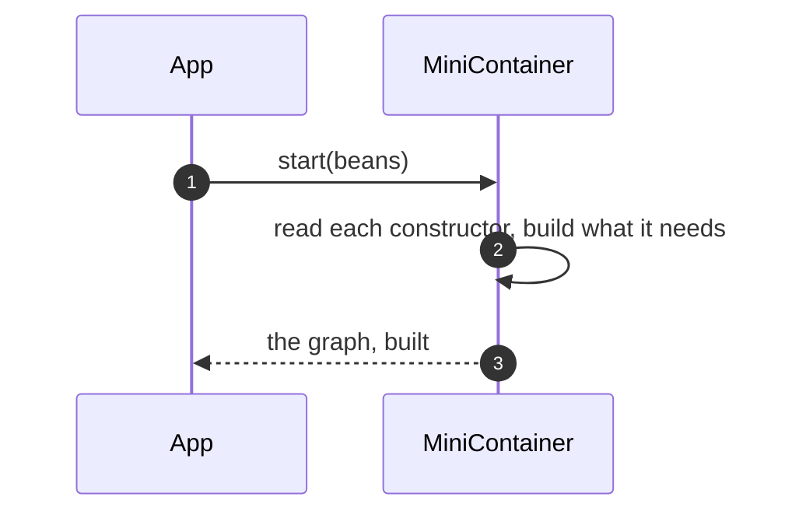
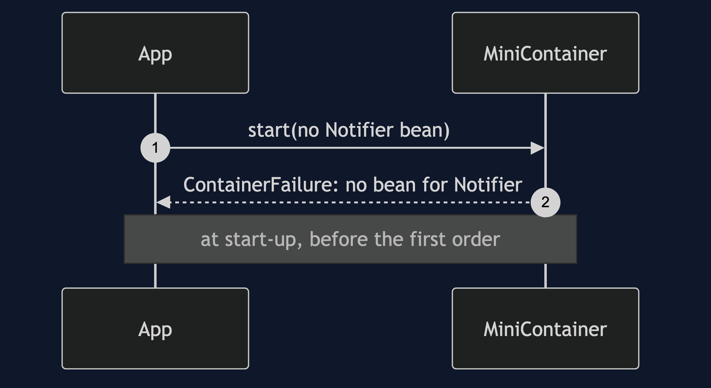
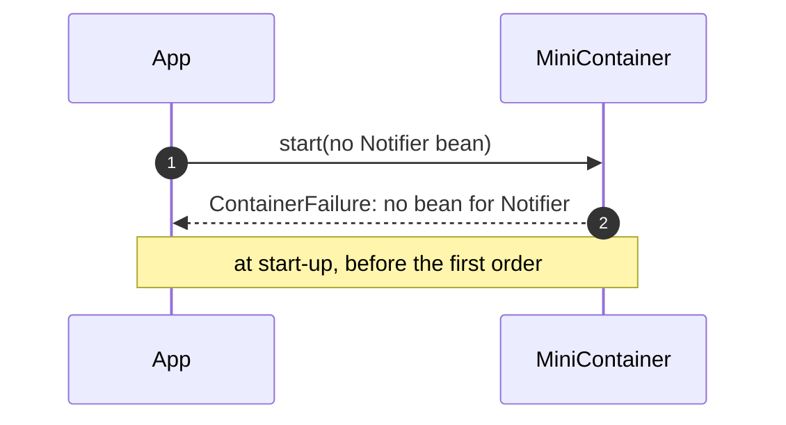

# Dependency Injection Pattern — UML Sequence Diagrams

Four sequences.

## 1. Wired By Hand

Mermaid source

## 2. Field Injection

Mermaid source

## 3. A Container Starts

Mermaid source

## 4. A Start-Up Failure

Mermaid source

