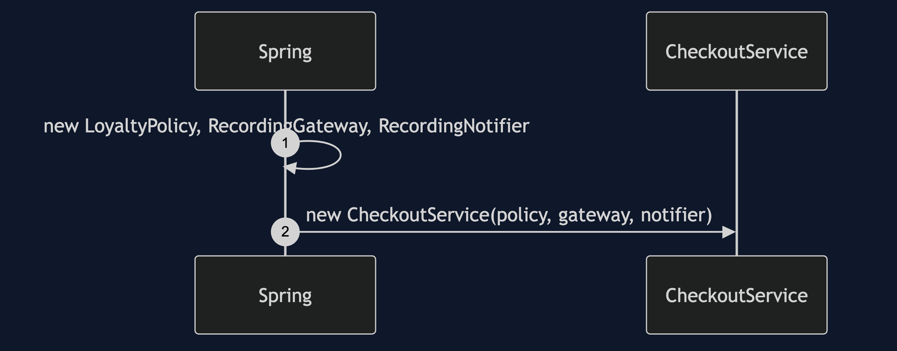
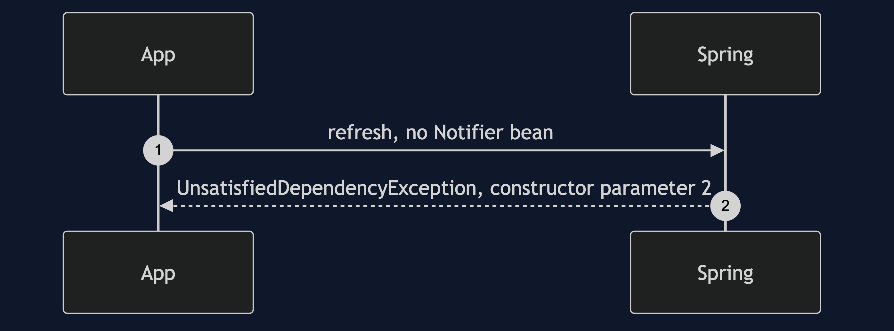
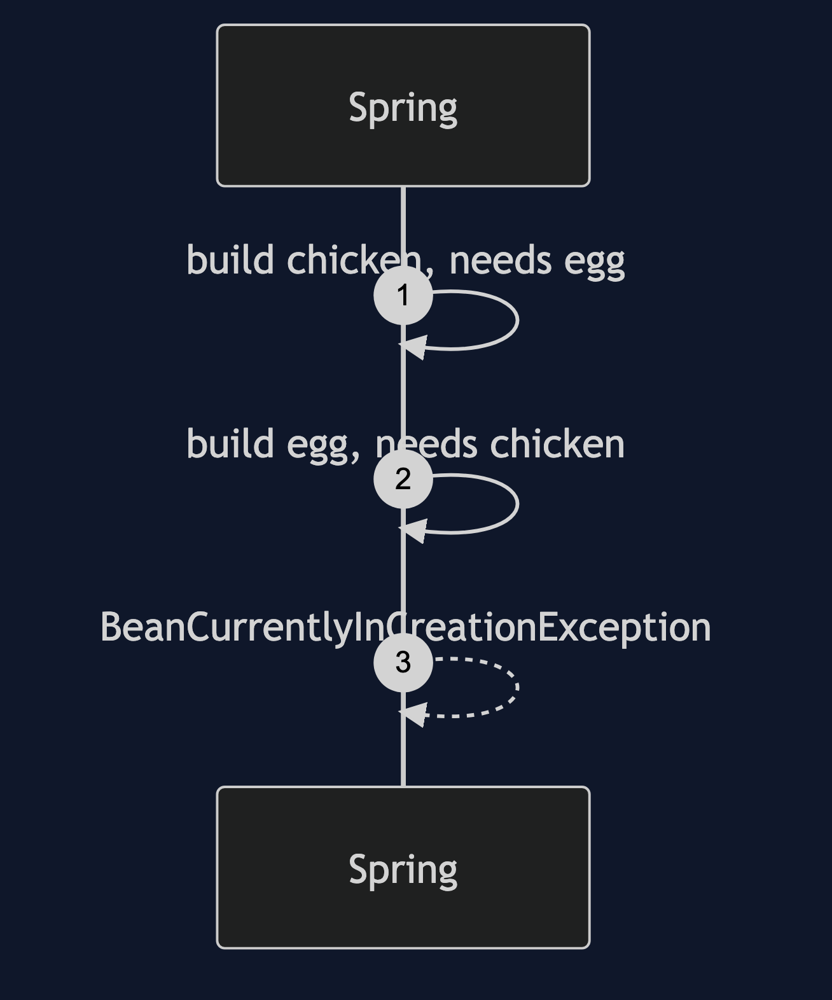
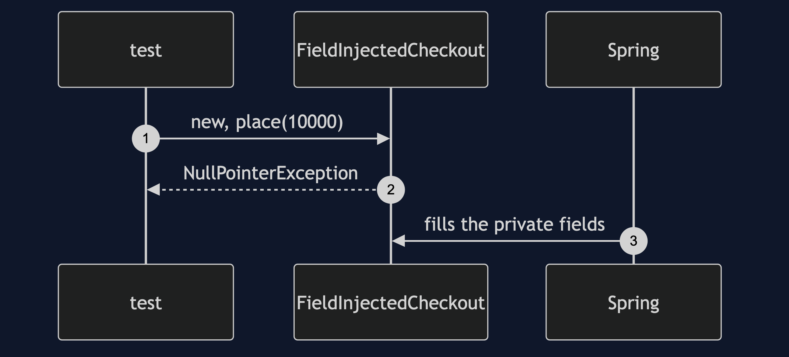

# Dependency Injection with Spring Pattern

```
src/main/java/com/jk/explore/diwithspring/
├── SpringDiApplication.java         the Spring Boot entry point and the six acts
│
├── domain/                          ← the partner's collaborators, with @Component added
│   ├── DiscountPolicy.java  LoyaltyPolicy.java
│   ├── PaymentGateway.java  RecordingGateway.java
│   └── Notifier.java  RecordingNotifier.java
├── app/                             ← the partner's classes; constructors untouched
│   ├── CheckoutService.java  ReceiptPrinter.java  Auditor.java  Storefront.java
│   └── OverloadedService.java
├── forms/
│   └── FieldInjectedCheckout.java    @Autowired on private fields
└── container/
    └── Chicken.java  Egg.java        a circular dependency, refused at start-up
```

**Spring's container does what the partner project's `Wiring.build()` did by hand: it reads each constructor and builds the graph. The idea is the same, and only the typing is gone.**

This project is the framework version of [Dependency Injection](../dependency-injection-pattern). That project wired the application by hand in nine lines and wrote an 86-line container. This one runs the same classes, with one annotation added to each, through Spring Boot's container. It does not re-teach the pattern. It shows what the annotations replaced, Spring's real start-up failures, and what the magic costs.

## Run

```bash
./gradlew run
```

Six acts. The partner project wired this application by hand in nine lines and wrote a small container. Here the same classes, with one annotation added to each, are wired by Spring Boot's container.

```
DEPENDENCY INJECTION WITH SPRING — recognise the wiring

ONE. The same graph, with no wiring code.
  Wiring.build() is gone. Spring built the graph from the constructors.
  charged [9000], messages sent 3, exactly as by hand.

TWO. What each annotation replaced.
  by hand, in the partner project:  new LoyaltyPolicy(), new CheckoutService(policy, gateway, notifier), ...
  here: @Component on each class, and the constructor parameters say the rest.
  beans Spring built: [Auditor, CheckoutService, LoyaltyPolicy, ReceiptPrinter, RecordingGateway, RecordingNotifier, Storefront]
  one annotation per class replaced 7 lines of new. the constructors are untouched.

THREE. A bean that is missing: a real Spring start-up failure.
  UnsatisfiedDependencyException, when the context starts:
  Error creating bean with name 'checkoutService': Unsatisfied dependency expressed through constructor parameter 2: No qualifying bean of type 'com.jk.explore.diwithspring...
  the same failure as the hand-written container, and better than a locator's: at start-up, not on the first order.
  still not at compile time.

FOUR. A circular dependency.
  BeanCurrentlyInCreationException: Error creating bean with name 'chicken': Requested bean is currently in creation: Is there an unresolvable circular reference or an asynchronous initialization dependency...
  since Spring 6 a cycle is refused by default, at start-up.

FIVE. Field injection: Spring can fill it, nothing else can.
  new FieldInjectedCheckout() compiled, and placing an order threw NullPointerException.
  inside a Spring context it works: receipt-1
  Spring's own guidance is constructor injection, for the reason above.

SIX. What the magic costs, and the verdict.
  building the graph by hand: about 438 nanoseconds each. a Spring context: about 2 ms, once.
  the cost is real and paid once at start-up. timings vary by machine.
  the verdict is unchanged: constructor injection, by hand until the wiring hurts, then a container.
  Spring did not add the idea. it removed the typing.
```

## Test

```bash
./gradlew test
```

2 test classes, 8 test methods, offline, each Spring context started inside the test, with no server.

## Technologies and versions

| What | Version | Why it is here |
| --- | --- | --- |
| Java | 21 | The repository standard, via the Gradle toolchain block |
| Gradle | 9.2.1 | The wrapper in this directory; no separate install needed |
| Spring Boot | 4.1.1 | The container, and `@Component` |
| Spring Framework | from Spring Boot 4.1.1 | The `ApplicationContext` that builds the graph |
| JUnit 5 | 5.10.2 | Test runner |

No web starter and no database. This project is about what an annotation and a constructor replace. See [`docs/dependencies.md`](docs/dependencies.md).

## Learning Material

| Document | What it covers |
| --- | --- |
| [`docs/problem-statement.md`](docs/problem-statement.md) | The partner's application, and what is new |
| [`docs/dependency-injection-with-spring-pattern-explained.md`](docs/dependency-injection-with-spring-pattern-explained.md) | What Spring adds, its failures, and its cost |
| [`docs/class-diagram.md`](docs/class-diagram.md) | The types |
| [`docs/architecture-diagram.md`](docs/architecture-diagram.md) | Spring as the composition root |
| [`docs/data-flow-diagram.md`](docs/data-flow-diagram.md) | How Spring builds a bean, and where it refuses |
| [`docs/sequence-diagram.md`](docs/sequence-diagram.md) | Written for a listener with the screen off |
| [`docs/uml-diagram.md`](docs/uml-diagram.md) | Four sequences |
| [`docs/animation.html`](docs/animation.html) | The six acts in a browser |
| [`docs/prerequisites.md`](docs/prerequisites.md) | What you need to know |
| [`docs/session.md`](docs/session.md) | A one-hour taught session |
| [`docs/spec.md`](docs/spec.md) | The generated specification |
| [`docs/youtube.md`](docs/youtube.md) | Title, description and chapters |
| [`docs/dependencies.md`](docs/dependencies.md) | What Spring is, what it costs, and that skipping this project loses none of the pattern |

### The pattern in one picture


### Where each piece sits


### How one request moves


### Who calls whom, in order


### All four sequences









### Video

Built from [`video/scenes.py`](video/scenes.py) by
[`video/build_video.sh`](video/build_video.sh). The rendered file is not
committed; see the repository README for why.

## Where you have already met this

In every Spring Boot application. This is where the annotations you copy from tutorials come from.

## When this is too much

For a small application that fits in `main`, hand wiring is shorter and has no magic.

## Where this sits

This project pairs with [Dependency Injection](../dependency-injection-pattern), and is the framework version in [`foundational-design-patterns`](..).
