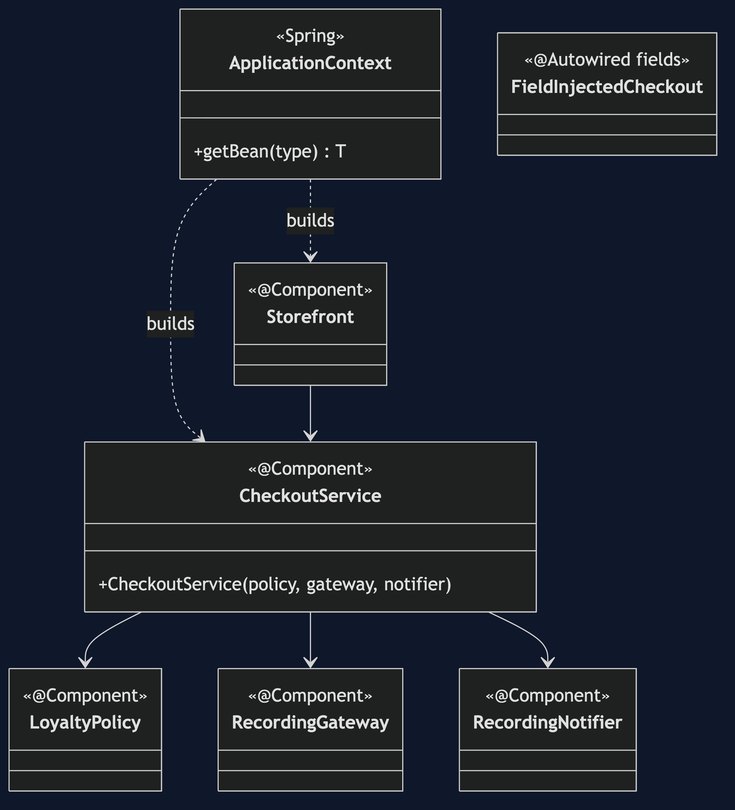
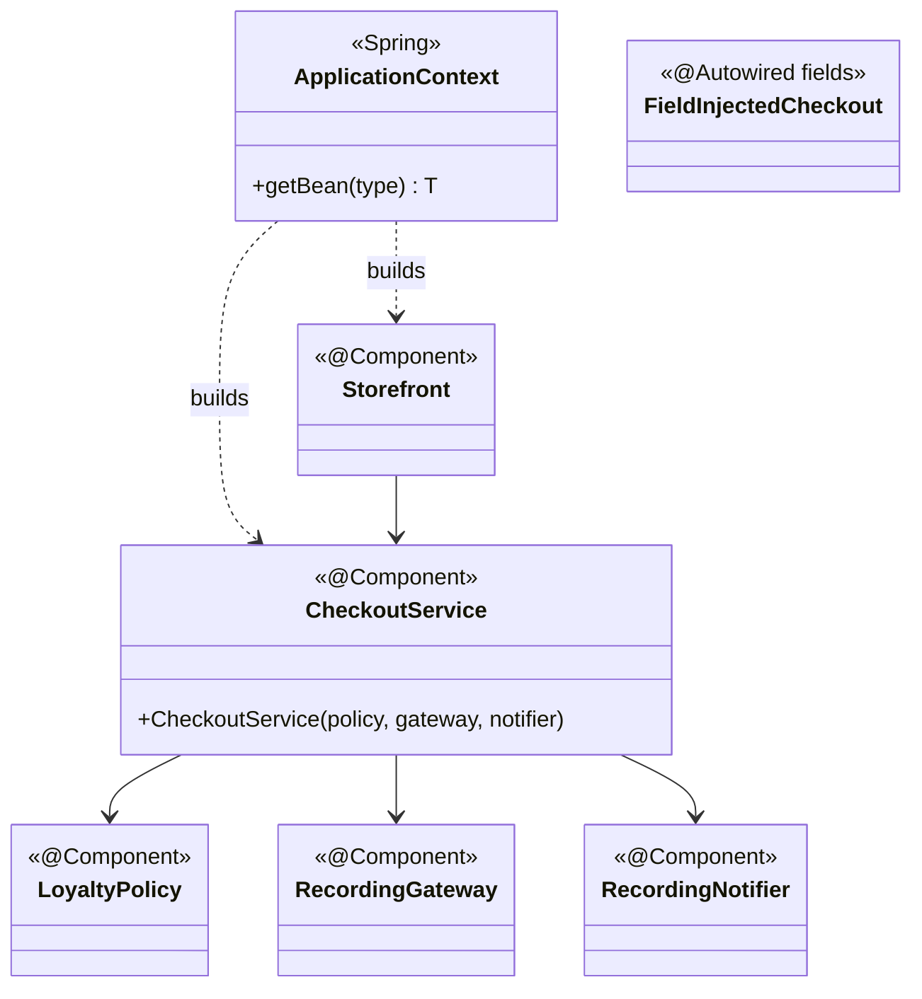

# Dependency Injection with Spring Pattern — Class Diagram

The partner's classes, with `@Component`. Spring's `ApplicationContext` builds them.

Mermaid source

```mermaid
classDiagram
    class ApplicationContext {
        <<Spring>>
        +getBean(type) T
    }
    class CheckoutService {
        <<@Component>>
        +CheckoutService(policy, gateway, notifier)
    }
    class Storefront {
        <<@Component>>
    }
    class LoyaltyPolicy {
        <<@Component>>
    }
    class RecordingGateway {
        <<@Component>>
    }
    class RecordingNotifier {
        <<@Component>>
    }
    class FieldInjectedCheckout {
        <<@Autowired fields>>
    }
    ApplicationContext ..> CheckoutService : builds
    ApplicationContext ..> Storefront : builds
    Storefront --> CheckoutService
    CheckoutService --> LoyaltyPolicy
    CheckoutService --> RecordingGateway
    CheckoutService --> RecordingNotifier
```

