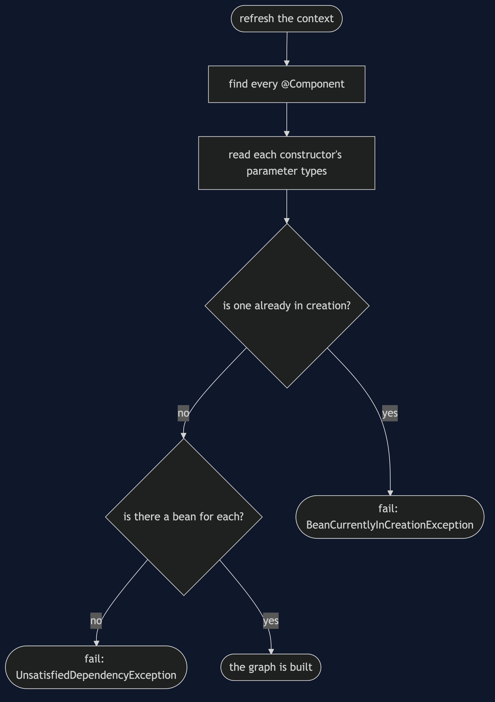
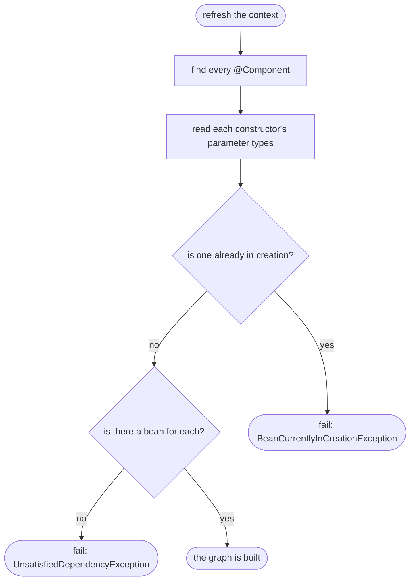

# Dependency Injection with Spring Pattern — Data Flow Diagram

How Spring builds one bean, and where it can refuse.

Mermaid source

```mermaid
flowchart TD
    Start(["refresh the context"])
    Scan["find every @Component"]
    Ctor["read each constructor's parameter types"]
    Have{"is there a bean for each?"}
    Cycle{"is one already in creation?"}
    Ok(["the graph is built"])
    Missing(["fail: UnsatisfiedDependencyException"])
    Circular(["fail: BeanCurrentlyInCreationException"])
    Start --> Scan --> Ctor --> Cycle
    Cycle -- yes --> Circular
    Cycle -- no --> Have
    Have -- no --> Missing
    Have -- yes --> Ok
```

