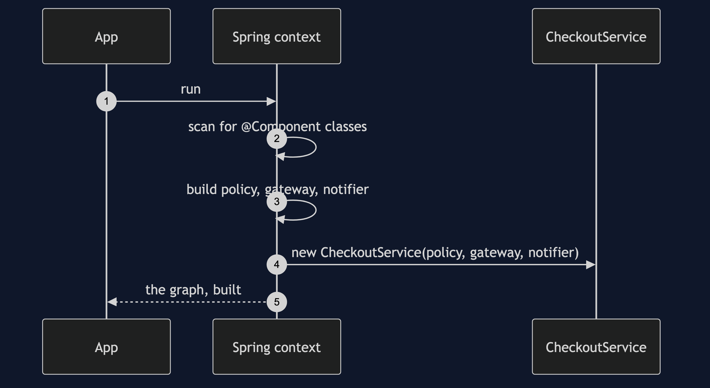
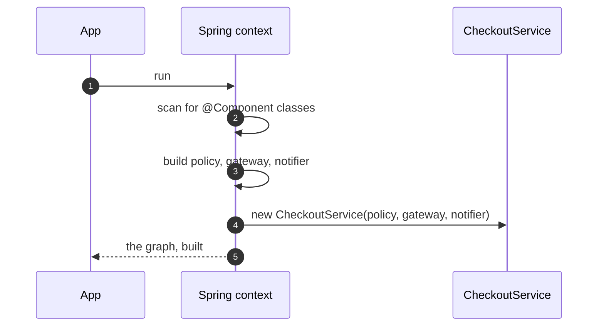

# Dependency Injection with Spring Pattern — Sequence Diagram

Written for a listener with the screen off.

Say it in words. The application starts, and Spring scans for classes marked as components. For each, it reads the constructor's parameter types. To build the checkout service, it first builds the discount policy, the gateway and the notifier, then calls the checkout service's constructor with them. If any parameter has no matching bean, it stops, right then, and names the parameter. Nothing has been ordered yet.

Mermaid source

The load-bearing sentence: **Spring did not add the idea, it removed the typing.**
