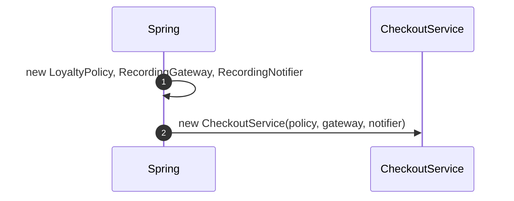
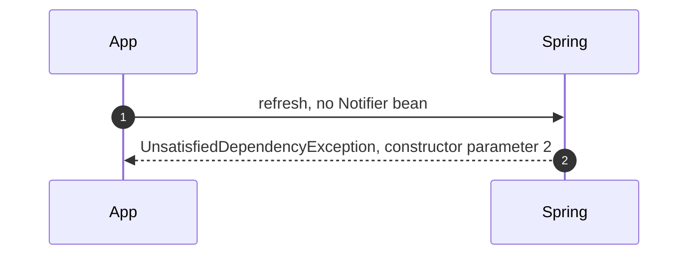
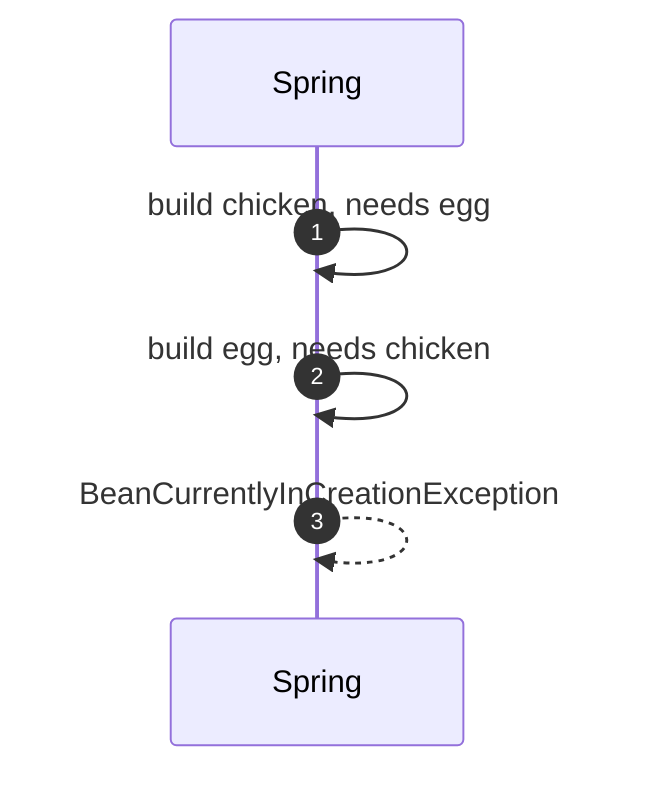
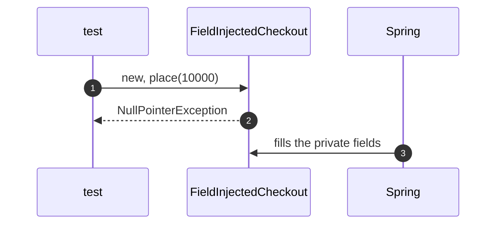

# Dependency Injection with Spring Pattern — UML Sequence Diagrams

Four sequences.

## 1. The Graph Is Built

Mermaid source

## 2. A Missing Bean

Mermaid source

## 3. A Circular Dependency

Mermaid source

## 4. Field Injection

Mermaid source

