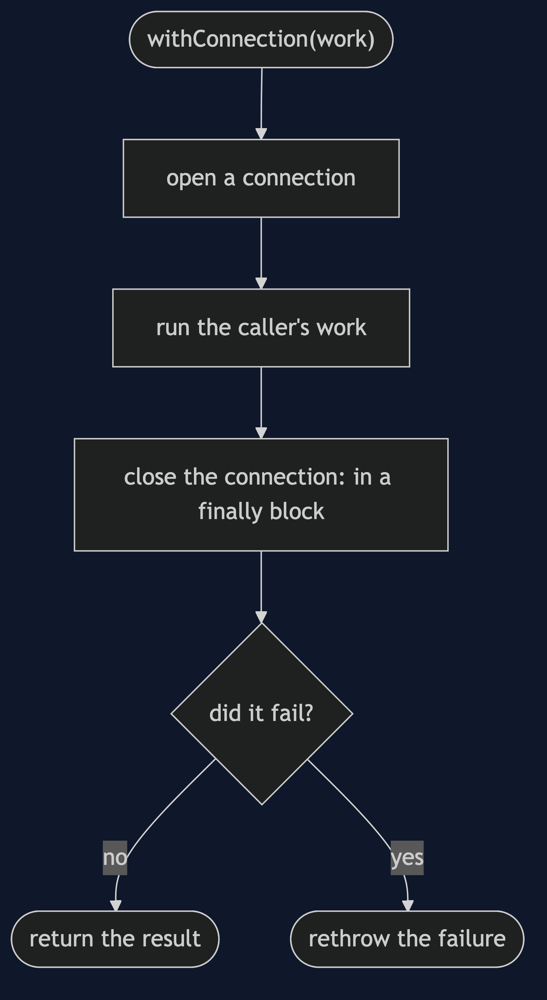
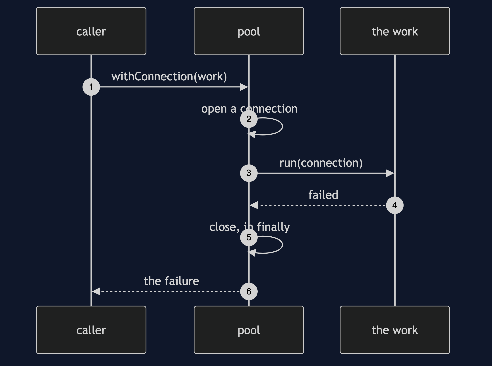

# Execute Around Pattern

```
src/main/java/com/jk/explore/executearound/
├── ExecuteAroundDemo.java           the six acts
├── Pool.java                        acquire and release; withConnection is the around method
├── Connection.java
├── Ledger.java                      inTransaction: all steps, or none
├── Timed.java                       around, for measuring
└── FakeClock.java
```

**Execute around: one method does the opening and closing, and the caller supplies the work in between.**

This project is in [foundational-design-patterns](..). It is the same idea as [Template Method](../../behavioural/template-method-pattern), with a lambda in place of a subclass, and it is what makes [Object Pool](../object-pool-pattern) safe to use.

## Run

```bash
./gradlew run
```

Six acts. Every number quoted below comes from this program's own output.

```
ONE. Open, use, close, by hand.
  the query broke, and the code that would close the connection was after it.
  connections still open: 1. repeat that on every failure, and the pool runs dry.
TWO. The caller gives the work, the pool does the rest.
  the same failure: the query broke.
  connections opened: 1, still open: 0. the closing is in one place, in a finally block, and cannot be forgotten.
THREE. Getting an answer out.
  a string came out: rows for orders where id = 7. a number came out: 15. still open: 0.
FOUR. All or nothing.
  two purchases of 3000 from a credit of 5000: the second failed with "not enough credit".
  balance afterwards: 5000. the first purchase was undone too.
  one purchase of 3000 that works: balance 2000.
FIVE. The same shape, for measuring.
  receipt sent in 5 ticks.
  and a failing job: mail server timed out, still measured: 9 ticks.
SIX. The bill.
  the caller let the connection out of the block, and used it later: connection 1 is closed. the block cannot stop that.
  the caller's code is now inside a lambda: it cannot return early, and it cannot throw a checked exception without help.
  and with two resources the blocks nest, one inside the other, so the real work drifts to the right.
```

## Test

```bash
./gradlew test
```

2 test classes, 7 test methods, offline, with nothing installed and no framework.

## Technologies and versions

| What | Version | Why it is here |
| --- | --- | --- |
| Java | 21 | The repository standard, via the Gradle toolchain block |
| Gradle | 9.2.1 | The wrapper in this directory; no separate install needed |
| JUnit 5 | 5.10.2 | Test runner |

No framework. A hand-built project stays plain Java so the mechanism is the whole lesson.

## Learning Material

| Document | What it covers |
| --- | --- |
| [`docs/problem-statement.md`](docs/problem-statement.md) | The scenario, and the problem |
| [`docs/execute-around-pattern-explained.md`](docs/execute-around-pattern-explained.md) | The pattern, and six acts |
| [`docs/class-diagram.md`](docs/class-diagram.md) | The types |
| [`docs/architecture-diagram.md`](docs/architecture-diagram.md) | The parts and how they connect |
| [`docs/data-flow-diagram.md`](docs/data-flow-diagram.md) | What happens to one request |
| [`docs/sequence-diagram.md`](docs/sequence-diagram.md) | Written for a listener with the screen off |
| [`docs/uml-diagram.md`](docs/uml-diagram.md) | Four sequences |
| [`docs/animation.html`](docs/animation.html) | The six acts in a browser |
| [`docs/prerequisites.md`](docs/prerequisites.md) | What you need to know |
| [`docs/session.md`](docs/session.md) | A one-hour taught session |
| [`docs/spec.md`](docs/spec.md) | The generated specification |
| [`docs/youtube.md`](docs/youtube.md) | Title, description and chapters |

### The pattern in one picture


### Where each piece sits


### How one request moves



### Who calls whom, in order



### All four sequences


### Video

Built from [`video/scenes.py`](video/scenes.py) by
[`video/build_video.sh`](video/build_video.sh). The rendered file is not
committed; see the repository README for why.

## Where you have already met this

Spring's template classes, Hibernate sessions, the try with resources statement, and test frameworks that run set-up and tear-down around each test.

## When this is too much

For a resource used once, in one place, try with resources is enough. Write your own around method when many callers repeat the same set-up and clean-up.

## Where this sits

This project is in [`foundational-design-patterns`](..), and is meant to be read with its neighbours there.
