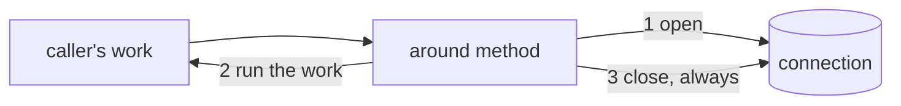

# Execute Around Pattern — Architecture Diagram

The around method wraps the caller's work.

Mermaid source

```mermaid
flowchart LR
    C["caller's work"] --> W["around method"]
    W -->|1 open| R[("connection")]
    W -->|2 run the work| C
    W -->|3 close, always| R
```

