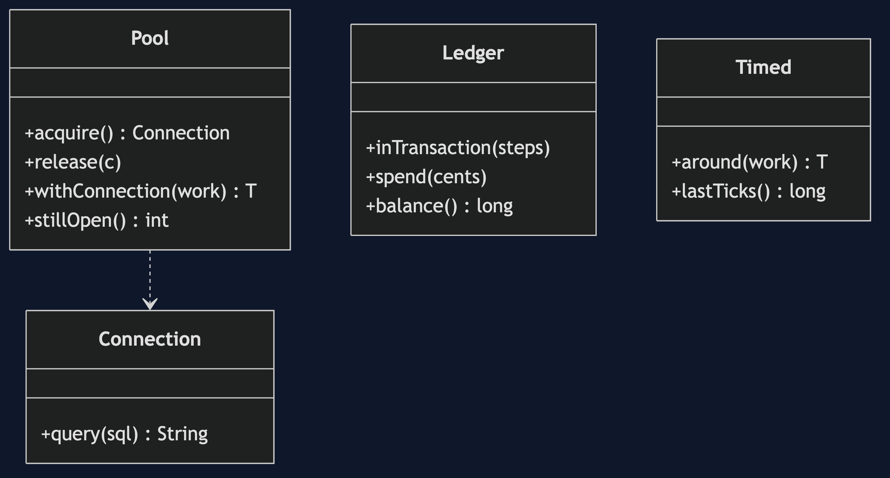
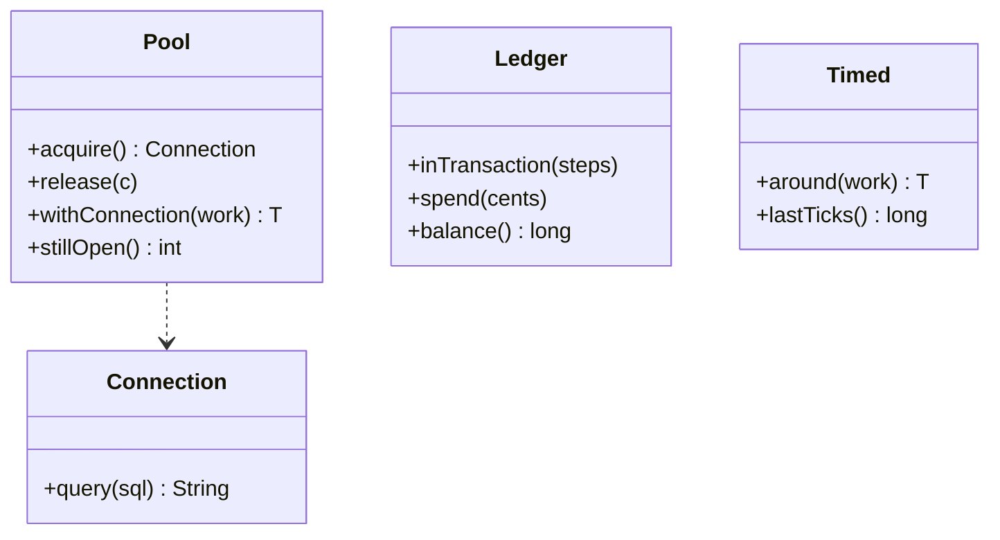

# Execute Around Pattern — Class Diagram

A pool with an around method, and two more classes with the same shape.

Mermaid source

```mermaid
classDiagram
    class Pool {
        +acquire() Connection
        +release(c)
        +withConnection(work) T
        +stillOpen() int
    }
    class Connection {
        +query(sql) String
    }
    class Ledger {
        +inTransaction(steps)
        +spend(cents)
        +balance() long
    }
    class Timed {
        +around(work) T
        +lastTicks() long
    }
    Pool ..> Connection
```

