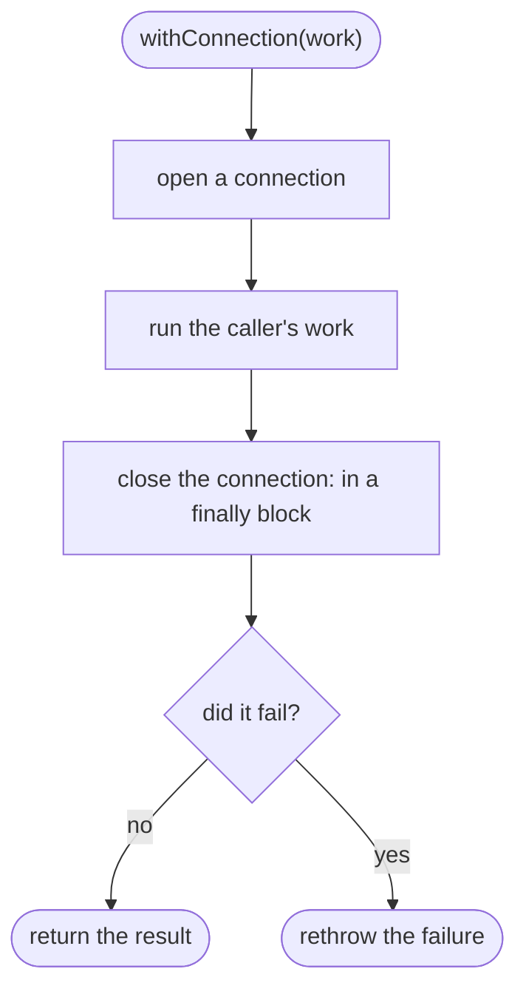

# Execute Around Pattern — Data Flow Diagram

What the around method does.

Mermaid source

```mermaid
flowchart TD
    Start(["withConnection(work)"])
    Open["open a connection"]
    Run["run the caller's work"]
    Ok{"did it fail?"}
    Close["close the connection: in a finally block"]
    Ret(["return the result"])
    Throw(["rethrow the failure"])
    Start --> Open --> Run --> Close
    Close --> Ok
    Ok -- no --> Ret
    Ok -- yes --> Throw
```

