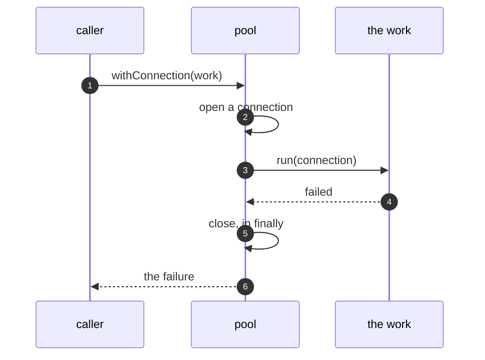

# Execute Around Pattern — Sequence Diagram

Written for a listener with the screen off.

Say it in words. The caller calls with connection, and hands over a piece of work. The pool opens a connection, and gives it to the work. The work runs a query, and fails. The pool closes the connection anyway, in its finally block, and the failure goes on to the caller. The caller did not write any closing.

Mermaid source

The load-bearing sentence: **the closing happens whatever the work does.**
