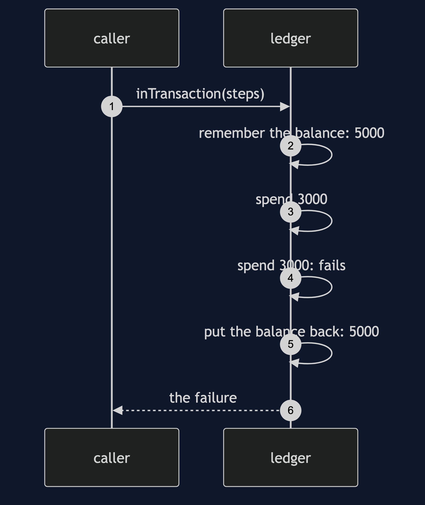
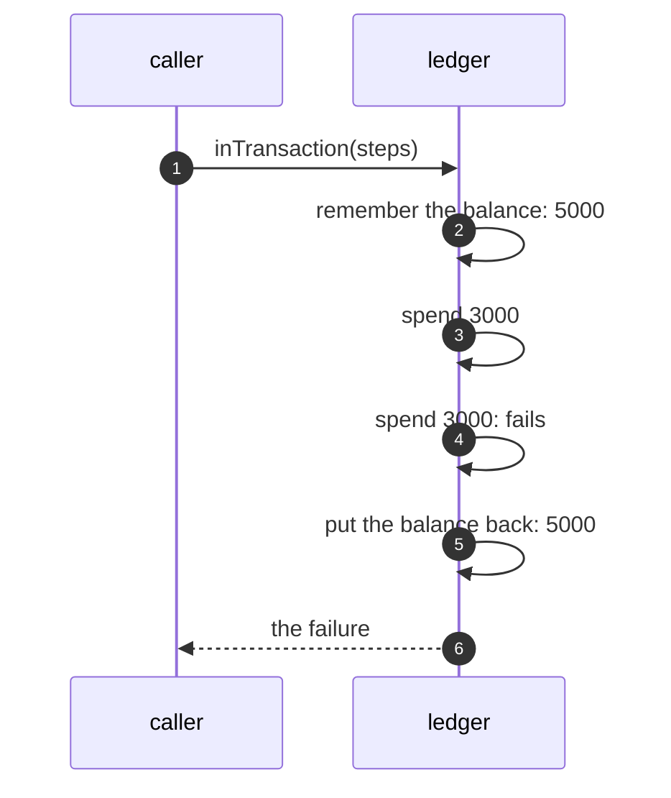

# Execute Around Pattern — UML Sequence Diagrams

Four sequences.

## 1. A Transaction

Mermaid source

```mermaid
sequenceDiagram
    autonumber
    participant C as caller
    participant L as ledger
    C->>L: inTransaction(steps)
    L->>L: remember the balance: 5000
    L->>L: spend 3000
    L->>L: spend 3000: fails
    L->>L: put the balance back: 5000
    L-->>C: the failure
```

